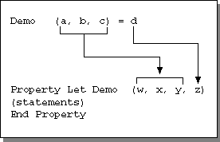

# Calling Property Procedures

The following table lists the syntax for calling property procedures:

|**Property Procedure**|**Syntax**|
|:-----|:-----|
|**Property Let**|[ _object_.] _propname_ ( _arguments_ )] = _argument_|
|**Property Get**| _varname_ = [ _object_.] _propname_ ( _arguments_ )]|
|**Property Set**|**Set** [ _object_.] _propname_ [.( _arguments_ )] = _varname_|

When you call a  **Property Let** or **Property Set** procedure, one [argument](vbe-glossary.md) always appears on the right side of the equal sign ( **=** ).

When you declare a  **Property Let** or **Property Set** procedure with multiple arguments, Visual Basic passes the argument on the right side of the call to the last argument in the **Property Let** or **Property Set** declaration. For example, the following diagram shows how arguments in the **Property** procedure call relate to arguments in the **Property Let** declaration:

In practice, the only use for property procedures with multiple arguments is to create [arrays](vbe-glossary.md) of [properties](vbe-glossary.md).

