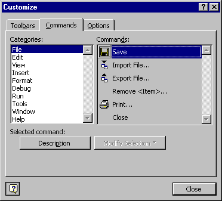

# Commands Tab (Customize Dialog Box)

Allows you to add controls and modify existing controls on the  **Menu** bar or any toolbar. You can also modify the button image and text of your added commands.

## Tab Options

 **Categories**

Lists the different command categories.

 **Commands**

Lists the controls available for the category you select in the Categories list. You can drag the command to the toolbar where you want the command to reside. To add the command to a menu, drag it over the menu's title and then into the location in the menu that appears.

 **Description**

Displays a QuickTip for the currently selected control.

 **Modify Selection**

Allows you to change the selected command.

- Reset — Resets the command to the default.
    
- Delete — Deletes the command.
    
- Name — Changes the name of the control to the name you type into the box. By using the ampersand (&;), you can also set shortcut keys.
    
- Copy Button Image — Copies the button image to the  **Clipboard**.
    
- Paste Button Image — Pastes the button image from the  **Clipboard**.
    
- Reset Button Image — Resets the button image to its default setting.
    
- Edit Button Image — Displays the  **Button** **Editor** dialog box.
    
- Change Button Image — Displays a list of button images from which you can select a different image for your button.
    
- Default Style — For toolbar buttons, shows only the icon. For menu items, shows the icon and the name.
    
- Text Only (Always) — Shows the command name only.
    
- Text Only (in Menus) — Hides the icon, if any, for menu items. This options has no effect on toolbar buttons.
    
- Image and Text — For toolbars, shows both the icon and name. This option has no effect on menu items.
    
- Begin a Group — For toolbars, puts a separator line before the control. Dimmed when the control is at the beginning of the toolbar.
    

