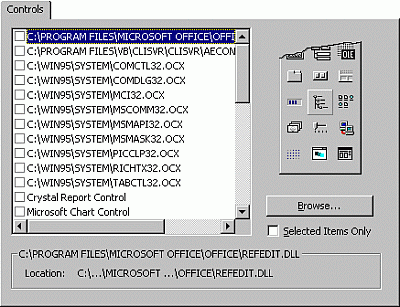

# Controls Tab (Components Dialog Box)

Allows you to add controls to your project's Toolbox.

 **Note**  This feature is not available in all versions of the Visual Basic Editor.

## Tab Options

 **Available Controls List**

Displays the available controls. You add a control by selecting the check box next to its name.

 **Note**  You can't remove a control that is used in your project.

 **Path**

Displays the path of the control selected in the Available Controls box.

 **Browse**

Displays the Add ActiveX Control dialog box where you can locate and open the control you want.

 **Selected Items Only**

When selected, displays only those controls in the Available Controls list which you have selected to include in the project.

 **Apply**

Adds the selected controls to the Toolbox without closing the dialog box.

 **OK**

Adds the selected controls to the Toolbox and closes the Components dialog box.

