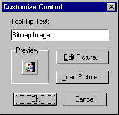

# Customize Control Dialog Box

Allows you to add  **ToolTips** and modify the icon for your control.

## Dialog Box Options

 **Tool Tip Text**

Contains the text for the tool tip.

 **Preview**

Shows the icon that you choose to use for the control.

 **Edit Picture**

Displays the  **Edit** **Picture** dialog box where you can modify the icon.

 **Load Picture**

Displays the  **Load** **Picture** dialog box. The **Load** **Picture** dialog box is a standard **Open** common dialog box.

