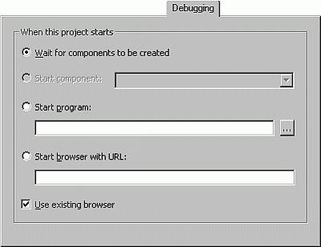

# Debugging Tab (Project Properties Dialog Box)





Allows you to specify additional actions to be taken when the IDE goes into run mode. This feature is not available in Standard EXE projects — only in projects that can create ActiveX components such as User Controls, User Documents, and ActiveX Designers (such as webclasses and DHTML Pages). These components are typically consumed by client programs like Internet Explorer and this Debugging tab automates the process of launching these client programs for the Visual Basic developer.

## Tab Options

 **When this project starts**

Sets debugging options when your project starts.

 **Wait for components to be created**

Tells Visual Basic to do nothing in run mode.

 **Start component**

Lets the component determine what happens. The types of components include special ActiveX Designers like the DHTMLPage Designer and the Webclass Designer, and also User Controls and User Documents. If you select a User Control or User Document, Visual Basic will launch the browser and display a dummy test page that contains the component. The component can tell Visual Basic to either launch the browser with a URL or start another program.

Selecting a startup component on the Debugging tab does not affect the Startup Object specified on the General tab. For example, an ActiveX.dll project could specify


```text
Startup Object=Sub Main 
```

and


```text
Start Component=DHTMLPage1 
```

When the project runs, Visual Basic would register the DHTMLPage1 component, as well as other components, execute and then launch the Internet Explorer and navigate to a URL that creates an instance of DHTMLPage1.

 **Start program**

Specifies an executable program to be used.

 **Start browser with URL**

Specifies which URL the browser should navigate to.

 **Use existing browser**

If Internet Explorer is already running, then use it. If not, launch a new browser.


