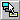
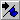
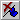

# Editor Toolbar

Contains buttons that are shortcuts to some commonly used menu items. Frequently used when editing code.

You can click a toolbar button once to carry out the action represented by that button. You can select the Show ToolTips option in the  **General** tab of the **Options** dialog box if you want to display ToolTips for the toolbar buttons.

## Toolbar Buttons

 **List Properties/Methods**

Opens a box in the code window that contains the properties and methods available for the object that precedes the period (.).

 **List Constants**

Opens a box in the  **Code** window that contains the constants that are valid choices for the property you typed and that precede the equals sign (=).

 **Quick Info**

Provides the syntax for a variable, function, method, or procedure based on the location of your pointer within the name of the function, method, or procedure.

 **Parameter Info**

Shows a popup in the  **Code** window that contains information about the parameters of the function in which the pointer is located.

 **Complete Word**

Accepts the characters that Visual Basic automatically adds to the word you are typing.

 **Indent**

Shifts all lines in the selection to the next tab stop.

 **Outdent**

Shifts all lines in the selection to the previous tab stop.

 **Toggle Breakpoint**

Sets or removes a [breakpoint](vbe-glossary.md) at the current line.

 **Comment Block**

Adds comment character to the beginning of each line of a selected block of text.

 **Uncomment Block**

Removes the comment character from each line of a selected block of text.

 **Toggle Bookmark**

Toggles a bookmark on or off for the active line in the  **Code** window.

 **Next Bookmark**

Moves the focus to the next bookmark in the bookmark stack.

 **Previous Bookmark**

Moves the focus to the previous bookmark in the bookmark stack.

 **Clear All Bookmarks**

Removes all bookmarks.

