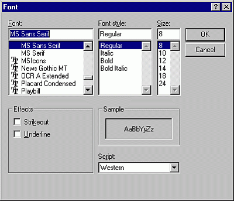

# Font Dialog Box

Use to change the fonts, the font size, and/or the font style you use for text and data fields.

## Dialog Box Options

 **Font**

Lists all the fonts that you have installed for Windows. When the box first appears, the font already in use for the selected element is highlighted.

 **Font Style**

Lists four additional attributes that you can assign to the font selected:

- Regular — Standard, unmodified style
    
- Bold — Boldface
    
- Italic — Italic
    
- Bold Italic — Bold Italic
    

 **Size**

Lists common point sizes for the highlighted font. When the box first appears, the point size for the font already in use for the selected element is highlighted, and the highlighted point size appears in the edit box at the top.

You can select directly from the list or type the new point size in the edit box at the top (if you know that you have additional sizes installed for the currently selected printer or if you are using scalable type).

 **Effects**

Lists two additional options that you can use for highlighting the selected font.

- Strikeout — Prints the strikeout character across the font
    
- Underline — Underlines the font You may select as many of the Effects as you wish.
    

 **Sample**

Displays a sample of the font you have selected. The sample shows the font, style, size, effects, and color you have specified. You can use this box to preview the results as you experiment with different formatting options.

 **Script**

Displays a list of available scripts.

 **OK**

Applies the font changes to the selected report element.

 **Cancel**

Cancels all font changes and leaves the selected element report unchanged.

