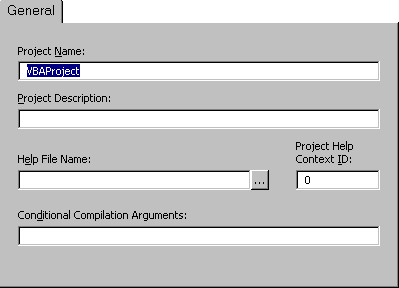

# General Tab (Project Properties Dialog Box)

Specifies the settings for the current Visual Basic project. The name of the project is displayed in the title bar.

## Tab Options

 **Project Name**

Identifies your component in the Windows Registry and the  **Object** **Browser**. It is important that it has a unique name.

The project name is the name of the  _type library_ for your component. The type library, or TypeLib, contains the description of the objects and interfaces provided by your component.

It is also used to qualify the names of classes. A combination of project name and class name is sometimes referred to as a  _fully qualified class name_, or as a _programmatic ID_. The fully qualified class name may be required to correctly identify an object as belonging to your component.

 **Help File Name**

Displays the name of the Help file associated with the project.

 **Project Description**

Sets the descriptive text that is displayed in the  **Description** pane at the bottom of the **Object** **Browser**.

 **Project Help Context ID**

Lists the context ID for the specific Help topic to be called when the user selects the 
 button while the application's[object library](vbe-glossary.md) is selected in the[Object Browser](vbe-glossary.md).

 **Conditional Compilation Arguments**

Lists the constant declarations used for conditional compilation. You can set multiple constants by separating them with colons, as in the following example:

`conFrenchVersion=-1:conANSI=0`

