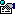
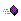
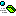
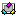
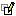
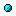
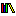
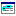
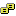

# Icons Used in the Object Browser and Code Windows

The  **Object** **Browser** and **Code** window contain many icons that represent classes and members. The following is a list of icons and what they represent.

|**This Icon:**|**Represents a:**|
|:-----|:-----|
|

|Property|
|

|Default Property|
|

|Method|
|

|Default Method|
|

|Event|
|

|Constant|
|

|Module|
|

|Class|
|

|User Defined Type|
|

|Global|
|

|Library|
|

|Project|
|

|Built-in keywords and types|
|

|Enum|

