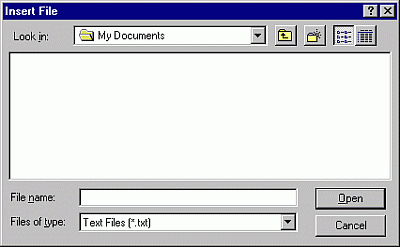

# Insert File Dialog Box

Allows you to look for and insert a file into a module in your project.

## Dialog Box Options

 **Look in**

Displays the computers, servers, drives, and folders available on your computer that you can use to locate the project you want to open.

 **Up One Level**

 Shows a list of folders or drives one level above the current server, computer, or folder.

 **Create New Folder**

 Creates a new folder.

 **List**

 Shows the folders or documents in a list format that includes the folder or document icon and its name.

 **Details**

 Shows the folder or documents in a list that includes the folder or document icon and name, its size (documents only), type, and the date and time it was last modified.

 **File Name**

Selector type the name of the file you want to insert.

 **List Files of Type**

Select a file type; the default is Text Files (*.txt). Files of the selected type will appear in the  **File Name** box.

 **Open**

Inserts the selected file.

 **Desktop**

Lists the folders and files on the desktop. The files and folders are displayed in the  **File** **Name** box.

 **Cancel**

Closes the dialog box without inserting a new file.

