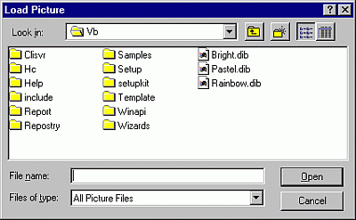

# Load Picture, Load Icon Dialog Boxes

Loads an existing picture file.

## Dialog Box Options

 **Look in**

Select the location of the picture you want to open.

 **Up One Level**

Shows a list of folders or drives one level above the current folder.

 **Create New Folder**

Creates a new folder.

 **List**

Shows the folders or files in a list format that includes the icon and its name.

 **Details**

Shows the folders or files in a list that includes the icon and name, its size, type, and the date and time it was last modified.

 **File name**

Select or type the name of a picture file you want to open.

 **List files of type**

Select a file type. Files of the selected type appear in the  **File** **Name** box.

- All Picture Files (*.bmp, *.dib, *.wmf, *.emf, *.ico, *.cur) — Lists all picture files.
    
- Bitmaps (*.bmp, *.dib) — Lists bitmaps and DIBs.
    
- Metafiles (*.wmf, *.wmf) — Lists Microsoft Windows Metafiles.
    
- Icons (*.ico, *.cur) — Lists the icons.
    
- All Files (*.*) — Lists files of all types.
    

 **Open**

Opens the selected file.

 **Cancel**

Closes the dialog box without loading a picture file.

 **Desktop**

Lists the folders and files on the desktop. The files and folders are displayed in the  **File** **Name** box.

