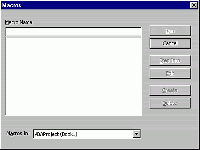

# Macros Dialog Box

Allows you to run, edit, or delete the selected macro. You can also create a macro from the  **Macros** dialog box.

## Dialog Box Options

 **Macro Name**

Contains the name of the selected macro or is blank if there are no macros in the Macro Box.

 **Macro Box**

Lists the available macros in the Project selected in the Macros In box.

 **Macros In**

Lists the available projects.

 **Run**

Runs the selected macro.

 **Step Into**

Highlights the first line of the macro and places the Current Execution Line Indicator.

 **Edit**

Opens the  **Code** window with the selected macro visible so you can modify your macro.

 **Create**

Opens a module in the  **Code** window so you can create a new macro.

 **Delete**

Removes the selected macro from your project.

