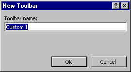

# New Toolbar Dialog Box

Allows you to give your new toolbar a name.

## Dialog Box Option

 **Toolbar name**

You can type the name for your new toolbar or use the default name. The default name changes for each custom toolbar, for example, Custom1, Custom2 and so on.

