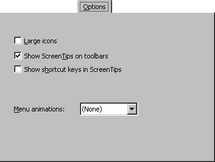

# Options Tab (Customize Dialog Box)

Allows you to change the appearance of your menu bar and toolbars.

## Tab Options

 **Large Icons**

Changes the toolbar icons to a larger size.

 **Show ScreenTips on toolbars**

Turns  **ScreenTips** off and on.

 **Show shortcut keys in ScreenTips**

Displays the shortcut keys on the menus.

 **Menu animations**

Lists available animations you can apply to your menu bar.

