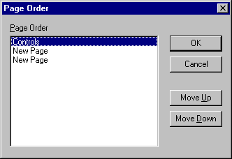

# Page Order Dialog Box

AllowSAs you to change the order of your tabbed pages.

## Dialog Box Options

 **Page Order**

Lists the tabbed pages in order from the left to the right.

 **Move Up**

Moves the selected page up one place in the list each time you click it.

 **Move Down**

Moves the selected page down one place in the list each time you click it.

