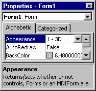

# Properties Window

Lists the design-time properties for selected objects and their current settings. You can change these properties at [design time](vbe-glossary.md). When you select multiple controls, the  **Properties** window contains a list of the properties common to all the selected controls.

## Window Elements

 **Object Box**

Lists the currently selected object. Only objects from the active form are visible. If you select multiple objects, the properties common to the objects and their settings, based on the first object selected, appear on the  **Properties** **List** tabs.

 **Properties List Tabs**

-  **Alphabetic Tab** — Alphabetically lists all properties for the selected object that can be changed at design time, as well as their current settings. You can change the property setting by selecting the property name and typing or selecting the new setting.
    
-  **Categorized Tab** — Lists all properties for the selected object by category. For example, **BackColor**, **Caption**, and **ForeColor** are in the Appearance category. You can collapse the list so that you see the categories or you can expand a category to see the properties. When you expand or collapse the list, you see a plus (+) icon or minus (-) icon to the left of the category name.
    

