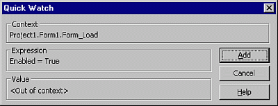

# Quick Watch Dialog Box

Displays the current value of a selected expression. This functionality is useful when debugging your code if you want to see the current value of a variable, property, or other expression.

## Dialog Box Options

 **Current Context**

Lists the names of the project, [module](vbe-glossary.md), and procedure where the [watch expression](vbe-glossary.md) resides.

 **Expression**

Shows the selected expression.

 **Value**

Shows the value of the selected expression. The current value isn't displayed if the expression context isn't within a procedure listed in the  **Calls** dialog box.

 **Add**

Adds the expression to the  **Watch** window.

