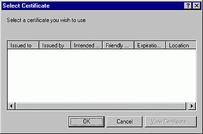

# Select Certificate Dialog Box

Allows you to select a certificate to assign to your project.

## Dialog Box Options

 **Issued to**

Displays the owner of a certificate.

 **Issued by**

Displays the issuer of a certificate.

 **Intended Purposes**

Displays the purpose of the certificate.

 **Friendly Name**

Displays the certificate name that users will see when opening a signed document.

 **Expiration Date**

Displays the date the certificate expires.

 **Location**

Displays the certificate's path.

 **OK**

Adds the selected certificate to the  **Digital Signature** dialog box.

 **Cancel**

Closes the dialog box without selecting any certificates.

 **View Certificate**

Displays the certificate that users will see when opening a signed document.

