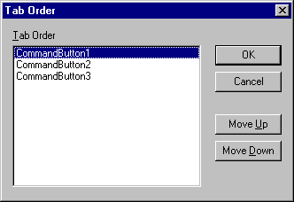

# Tab Order Dialog Box

Lists the tab order for the objects and allows you to change the order.

## Dialog Box Options

 **Tab Order**

Lists the objects, in their current order, on the form.

 **Move Up**

Moves the selected object up one position in the tab order each time you click it.

 **Move Down**

Moves the selected object down one position in the tab order each time you click it.

