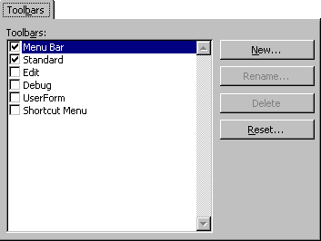

# Toolbars Tab (Customize Dialog Box)

Allows you to create, rename, delete, and reset your toolbars,

## Tab Options

Toolbars box

Displays the toolbars built into Visual Basic and any toolbars you create. When you show a toolbar, a check mark appears to the left of it.

 **Note**  The  **Menu** bar cannot be hidden. It can only be reset.

 **New**

Opens the  **New** **Toolbar** dialog box where you type the name for your new toolbar in the Toolbar Name box.

 **Rename**

Opens the  **Rename Toolbar** dialog box where you type the new name for your toolbar. Only available if you select a user-defined toolbar.

 **Delete**

Deletes a user-defined toolbar from your project. Only available if you select a user-defined toolbar.

 **Reset**

Removes any changes to the built-in toolbars and resets them to their original state. Only available if you select a built-in toolbar.

