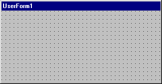

# UserForm Windows (Visual Basic User Interface)

Allows you to create the windows or dialog boxes in your project. You draw and view [controls](vbe-glossary.md) on a[form](vbe-glossary.md).

While you are designing a form:

- Each form window has a  **Maximize**, **Minimize**, and **Close** button.
    
- You can view the form grid and determine the size of the gridlines from the  **General** tab of the **Options** dialog box.
    
- Use the buttons in the  **Toolbox** to draw controls on the form. You can set your controls to align with the grid of your form from the **General** tab of the **Options** dialog box.
    

