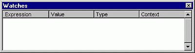

# Watch Window

Appears automatically when watch expressions are defined in the project.

You can:

- Change the size of the column headers by dragging its border to the right to make it larger or to the left to make it smaller.
    
- Drag a selected variable to the  **Immediate** window or the **Watch** window.
    
- Close the window by clicking the Close box. If the Close box is not visible, double-click the  **Title** bar to make the Close box visible, then click it.
    

## Window Elements

 **Expression**

Lists the watch expression with the  **Watch** icon,
 on the left.

 **Value**

List the value of the expression at the time of the transition to break mode.

You can edit a value and then press ENTER, the UP ARROW key, the DOWN ARROW key, TAB, SHIFT+TAB, or click somewhere on the screen to validate the change. If the value is illegal, the Edit field remains active and the value is highlighted. A message box describing the error also appears. Cancel a change by pressing ESC.

 **Type**

Lists the expression type.

 **Context**

Lists the context of the watch expression.

If the context of the expression isn't in [scope](vbe-glossary.md) when going to break mode, the current value isn't displayed.

You can close the window by clicking the Close box. If the Close box is not visible, double-click the  **Title** bar to make the Close box visible, then click it.

