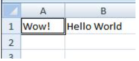

# Getting Started with VBA in Office

Are you facing a repetitive clean up of fifty tables in Word? Do you want a particular document to prompt the user for input when it opens? Are you having difficulty figuring out how to get your contacts from Microsoft Outlook into a Microsoft Excel spreadsheet efficiently?

You can perform these tasks and accomplish a great deal more by using VBA for Office−a simple, but powerful programming language that you can use to extend Office applications.

This article is for experienced Office users who want to learn about VBA and who want some insight into how programming can help them to customize Office.

The Office suite of applications has a rich set of features. There are many different ways to author, format, and manipulate documents, e-mail, databases, forms, spreadsheets, and presentations. The great power of VBA programming in Office is that nearly every operation that you can perform with a mouse, keyboard, or a dialog box can also be done by using VBA. Further, if it can be done once with VBA, it can be done just as easily a hundred times. (In fact, the automation of repetitive tasks is one of the most common uses of VBA in Office.)

Beyond the power of scripting VBA to accelerate every-day tasks, you can use VBA to add new functionality to Office applications or to prompt and interact with the user of your documents in ways that are specific to your business needs. For example, you could write some VBA code that displays a pop up message that reminds users to save a document to a particular network drive the first time they try to save it.

This article explores some of the primary reasons to leverage the power of VBA programming. It explores the VBA language and the out-of-the-box tools that you can use to work with your solutions. Finally, it includes some tips and ways to avoid some common programming frustrations and missteps.


## When to Use VBA and Why
<a name="odc_office14_ta_AddingVBAProgrammingToYourOfficeToolkit_WhenAndWhyToUseVBA"> </a>

There are three principal reasons to consider VBA programming in Office.


### Automation &amp; Repetition

VBA is effective and efficient when it comes to repetitive solutions to formatting or correction problems. For example, have you ever changed the style of the paragraph at the top of each page in Word? Have you ever had to reformat multiple tables that were pasted from Excel into a Word document or an Outlook e-mail? Have you ever had to make the same change in multiple Outlook contacts?

If you have a change that you have to make more than ten or twenty times, it may be worth automating it with VBA. If it is a change that you have to do hundreds of times, it certainly is worth considering. Almost any formatting or editing change that you can do by hand, can be done in VBA.


### Extensions to User Interaction

There are times when you want to encourage or compel users to interact with the Office application or document in a particular way that is not part of the standard application. For example, you might want to prompt users to take some particular action when they open, save, or print a document.


### Interaction between Office Applications

Do you need to copy all of your contacts from Outlook to Word and then format them in some particular way? Or, do you need to move data from Excel to a set of PowerPoint slides? Sometimes simple copy and paste does not do what you want it to do, or it is too slow. You can use VBA programming to interact with the details of two or more Office applications at the same time and then modify the content in one application based on the content in another.


### Doing Things another Way

VBA programming is a powerful solution, but it is not always the optimal approach. Sometimes it makes sense to use other ways to achieve your aims.

The critical question to ask is whether there is an easier way. Before you begin a VBA project, consider the built-in tools and standard functionalities. For example, if you have a time-consuming editing or layout task, consider using styles or accelerator keys to solve the problem. Can you perform the task once and then use CTRL+Y (Redo) to repeat it? Can you create a new document with the correct format or template, and then copy the content into that new document? 

Office applications are powerful; the solution that you need may already be there. Take some time to learn more about Office before you jump into programming.

Before you begin a VBA project, ensure that you have the time to work with VBA. Programming requires focus and can be unpredictable. Especially as a beginner, never turn to programming unless you have time to work carefully. Trying to write a "quick script" to solve a problem when a deadline looms can result in a very stressful situation. If you are in a rush, you might want to use conventional methods, even if they are monotonous and repetitive.


## VBA Programming 101
<a name="odc_office14_ta_AddingVBAProgrammingToYourOfficeToolkit_VBAProgramming101"> </a>


### Using Code to Make Applications Do Things

You might think that writing code is mysterious or difficult, but the basic principles use every-day reasoning and are quite accessible. Microsoft Office applications are created in such a way that they expose things called objects that can receive instructions, in much the same way that a phone is designed with buttons that you use to interact with the phone. When you press a button, the phone recognizes the instruction and includes the corresponding number in the sequence that you are dialing. In programming, you interact with the application by sending instructions to various objects in the application. These objects are expansive, but they have their limits. They can only do what they are designed to do, and they will only do what you instruct them to do.

For example, consider the user who opens a document in Word, makes a few changes, saves the document, and then closes it. In the world of VBA programming, Word exposes a Document object. By using VBA code, you can instruct the Document object to do things such as Open, Save, or Close.

The following section discusses how objects are organized and described.


#### The Object Model

Developers organize programming objects in a hierarchy, and that hierarchy is called the object model of the application. Word, for example, has a top-level Application object that contains a Document object. The Document object contains Paragraph objects and so on. Object models roughly mirror what you see in the user interface. They are a conceptual map of the application and its capabilities.

The definition of an object is called a class, so you might see these two terms used interchangeably. Technically, a class is the description or template that is used to create, or instantiate, an object.

Once an object exists, you can manipulate it by setting its properties and calling its methods. If you think of the object as a noun, then the properties are the adjectives that describe the noun and the methods are the verbs that animate the noun. Changing a property changes some quality of appearance or behavior of the object. Calling one of the object methods causes the object to perform some action.

The VBA code in this article runs against an open Office application where many of the objects that the code manipulates are already up and running; for example, the Application itself, the Worksheet in Excel, the Document in Word, the Presentation in PowerPoint, the Explorer and Folder objects in Outlook. Once you know the basic layout of the object model and some key properties of the Application that give access to its current state, you can start to extend and manipulate that Office application with VBA in Office.


#### Methods

In Word, for example, you can change the properties and invoke the methods of the current Word document by using the  **ActiveDocument** property of the **Application** object. This **ActiveDocument** property returns a reference to the **Document** object that is currently active in the Word application. "Returns a reference to" means "gives you access to."

The following code does exactly what it says; that is, it saves the active document in the application.


```VB.net
Application.ActiveDocument.Save
```

Read the code from left to right, "In this Application, with the Document referenced by ActiveDocument, invoke the Save method." Be aware that Save is the simplest form of method; it does not require any detailed instructions from you. You instruct a  **Document** object to **Save** and it does not require any more input from you.

If a method requires more information, those details are called parameters. The following code runs the  **SaveAs** method, which requires a new name for the file.


```VB.net
Application.ActiveDocument.SaveAs ("New Document Name.docx")
```

Values listed in parenthesis after a method name are the parameters. Here, the new name for the file is a parameter for the  **SaveAs** method.


#### Properties

You use the same syntax to set a property that you use to read a property. The following code executes a method to select cell A1 in Excel and then to set a property to put something in that cell.


```VB.net
    Application.ActiveSheet.Range("A1").Select
    Application.Selection.Value = "Hello World"
```

The first challenge in VBA programming is to get a feeling for the object model of each Office application and to read the object, method, and property syntax. The object models are similar in all Office applications, but each is specific to the kind of documents and objects that it manipulates.

In the first line of the code snippet, there is the  **Application** object, Excel this time, then the **ActiveSheet**, which provides access to the active worksheet. After that is a term not as familiar, Range, which means "define a range of cells in this way." The code instructs  **Range** to create itself with just A1 as its defined set of cells. In other words, the first line of code defines an object, the Range, and runs a method against it to select it. The result is automatically stored in another property of the **Application** called **Selection**.

The second line of code sets the  **Value** property of **Selection** to the text "Hello World" and that value appears in cell A1.

The simplest VBA code that you write might simply gain access to objects in the Office application that you are working with and set properties. For example, you could get access to the rows in a table in Word and change their formatting in your VBA script. 

That sounds simple, but it can be incredibly useful; once you can write that code, you can harness all of the power of programming to make those same changes in several tables or documents, or make them according to some logic or condition. For a computer, making 1000 changes is no different from making 10, so there is an economy of scale here with larger documents and problems, and that is where VBA can really shine and save you time.


### Macros and the Visual Basic Editor

Now that you know something about how Office applications expose their object models, you are probably eager to try calling object methods, setting object properties, and responding to object events. To do so, you must write your code in a place and in a way that Office can understand; typically, by using the Visual Basic Editor. Although it is installed by default, many users do not know that it is even available until it is enabled on the ribbon.


#### Opening the Developer Tab

All Office applications use the ribbon. One tab on the ribbon is the  **Developer** tab, where you access the Visual Basic Editor and other developer tools. Because Office does not display the **Developer** tab by default, you must enable it by using the following procedure:


### To enable the Developer tab


1. On the  **File** tab, choose **Options** to open the **Options** dialog box.
    
2. Click  **Customize Ribbon** on the left side of the dialog box.
    
3. Under  **Choose commands from** on the left side of the dialog box, select **Popular Commands**.
    
4. Under  **Customize the Ribbon** on the right side of the dialog box, select **Main Tabs** in the drop down list box, and then select the **Developer** checkbox.
    
5. Click  **OK**.
    

 **Note**  In Office 2007, you displayed the Developer tab by clicking the Office button, clicking  **Options**, and then selecting the  **Show Developer tab in Ribbon** checkbox in the **Popular** category of the **Options** dialog box

After you enable the  **Developer** tab, it is easy to find the **Visual Basic** and **Macros** buttons.


**Figure 1. Buttons on the Developer tab**


#### Security Issues

To protect Office users against viruses and dangerous macro code, you cannot save macro code in a standard Office document that uses a standard file extension. Instead, you must save the code in a file with a special extension. For example you cannot save macros in a standard Word document with a .docx extension; instead, you must use a special Word Macro-Enabled Document with a .docm extension.

When you open a .docm file, Office security might still prevent the macros in the document from running, with or without telling you. Examine the settings and options in the Trust Center on all Office applications. The default setting disables macro from running, but warns you that macros have been disabled and gives you the option to turn them back on for that document. 

You can designate specific folders where macros can run by creating Trusted Locations, Trusted Documents, or Trusted Publishers. The most portable option is to use Trusted Publishers, which works with digitally signed documents that you distribute. For more information about the security settings in a particular Office application, open the  **Options** dialog box, click **Trust Center**, and then click  **Trust Center Settings**.


 **Note**  Some Office applications, like Outlook, save macros by default in a master template on your local computer. Although that strategy reduces the local security issues on your own computer when you run your own macros, it requires a deployment strategy if you want to distribute your macro. 


#### Recording a Macro

When you click the  **Macro** button on the **Developer** tab, it opens the **Macros** dialog box, which gives you access to VBA subroutines or macros that you can access from a particular document or application. The **Visual Basic** button opens the Visual Basic Editor, where you create and edit VBA code.

Another button on the  **Developer** tab in Word and Excel is the **Record Macro** button, which automatically generates VBA code that can reproduce the actions that you perform in the application. **Record Macro** is a terrific tool that you can use to learn more about VBA. Reading the generated code can give you insight into VBA and provide a stable bridge between your knowledge of Office as a user and your knowledge as a programmer. The only caveat is that the generated code can be confusing because the Macro editor must make some assumptions about your intentions, and those assumptions are not necessarily accurate.


### To record a macro


1. Open Excel to a new Workbook and click the  **Developer** tab in the ribbon. Click **Record Macro** and accept all of the default settings in the **Record Macro** dialog box, includingMacro1 as the name of the macro andThis Workbook as the location.
    
2. Click  **OK** to begin recording the macro. Note how the button text changes to **Stop Recording**. Click that button the instant you complete the actions that you want to record.
    
3. Click in cell B1 and type the programmer's classic first string: Hello World. Stop typing and look at the  **Stop Recording** button; it is grayed out because Excel is waiting for you to finish typing the value in the cell.
    
4. Click in cell B2 to complete the action in cell B1, and then click  **Stop Recording**.
    
5. Click  **Macros** on the ** Developer** tab, select **Macro1** if it is not selected, and then click **Edit** to view the code from Macro1 in the Visual Basic Editor.
    

**Figure 2. Macro code in Visual Basic Editor**


#### Looking at the Code

The macro that you created should look similar to the following code.


```VB.net
Sub Macro1()
'
' Macro1 Macro
'
'
    Range("B1").Select
    ActiveCell.FormulaR1C1 = "Hello World"
    Range("B2").Select
End Sub
```

Be aware of the similarities to the earlier code snippet that selected text in cell A1, and the differences. In this code, cell B1 is selected, and then the string "Hello World" is applied to the cell that has been made active. The quotes around the text specify a string value as opposed to a numeric value. 

Remember how you clicked cell B2 to display the  **Stop Recording** button again? That action shows up as a line of code as well. The macro recorder records every keystroke.

The lines of code that start with an apostrophe and colored green by the editor are comments that explain the code or remind you and other programmers the purpose of the code. VBA ignores any line, or portion of a line, that begins with a single quote. Writing clear and appropriate comments in your code is an important topic, but that discussion is out of the scope of this article. Subsequent references to this code in the article do not include those four comment lines.

When the macro recorder generates the code, it uses a complex algorithm to determine the methods and the properties that you intended. If you do not recognize a given property, there are many resources available to help you. For example, in the macro that you recorded, the macro recorder generated code that refers to the  **ForumulaR1C1** property. Not sure what that means?


 **Tip**  Note: Be aware that  **Application** object is implied in all VBA macros. The code that you recorded works with **Application.** at the beginning of each line.


#### Using Developer Help

Select  **ForumulaR1C1** in the recorded macro and press F1. The Help system runs a quick search, determines that the appropriate subjects are in the Excel Developer section of the Excel Help, and lists the **FormulaR1C1** property. You can click the link to read more about the property, but before you do, be aware that the **Excel Object Model Reference** link near the bottom of the window. Click the link to view a long list of objects that Excel uses in its object model to describe the Worksheets and their components. Click any one of those to see the properties and methods that apply to that particular object, along with cross references to different related options. Many Help entries also have brief code examples that can help you. For example, you can follow the links in the **Borders** object to see how to set a border in VBA.


```VB.net
Worksheets(1).Range("A1").Borders.LineStyle = xlDouble
```


#### Editing the Code

The Borders code looks different from the recorded macro. One thing that can be confusing with an object model is that there is more than one way to address any given object, cell A1 in this example. 

Sometimes the best way to learn programming is to make minor changes to some working code and see what happens as a result. Try it now. Open Macro1 in the Visual Basic Editor and change the code to the following.


```VB.net
Sub Macro1()
    Worksheets(1).Range("A1").Value = "Wow!"
    Worksheets(1).Range("A1").Borders.LineStyle = xlDouble
End Sub
```


 **Tip**  Use Copy and Paste as much as possible when working with code to avoid typing errors. 

You do not need to save the code to try it out, so return to the Excel document, click  **Macros** on the **Developer** tab, click **Macro1**, and then click  **Run**. Cell A1 now contains the text Wow! and has a double-line border around it.


**Figure 3. Results of your first macro**



You just combined macro recording, reading the object model documentation, and simple programming to make a VBA program that does something. Congratulations!

Did not work? Read on for debugging suggestions in VBA.


## Programming Tips and Tricks
<a name="odc_office14_ta_AddingVBAProgrammingToYourOfficeToolkit_ProgrammingTipsAndTricks"> </a>


### Start with Examples

The VBA community is very large; a search on the Web can almost always yield an example of VBA code that does something similar to what you want to do. If you cannot find a good example, try to break the task down into smaller units and search on each of those, or try to think of a more common, but similar problem. Starting with an example can save you hours of time.

That does not mean that free and well-thought-out code is on the Web waiting for you to come along. In fact, some of the code that you find might have bugs or mistakes. The idea is that the examples you find online or in VBA documentation give you a head start. Remember that learning programming requires time and thought. Before you get in a big rush to use another solution to solve your problem, ask yourself whether VBA is the right choice for this problem.


### Make a Simpler Problem

Programming can get complex quickly. It is critical, especially as a beginner, that you break the problem down to the smallest possible logical units, then write and test each piece in isolation. If you have too much code in front of you and you get confused or muddled, stop and set the problem aside. When you come back to the problem, copy out a small piece of the problem into a new module, solve that piece, get the code working, and test it to ensure that it works. Then move on to the next part. 


### Bugs and Debugging

There are two main types of programming errors: syntax errors, which violate the grammatical rules of the programming language, and run-time errors, which look syntactically correct, but fail when VBA attempts to execute the code.

Although they can be frustrating to fix, syntax errors are easy to catch; the Visual Basic Editor beeps and flashes at you if you type a syntax error in your code.

For example, string values must be surrounded by double quotes in VBA. To find out what happens when you use single quotes instead, return to the Visual Basic Editor and replace the "Wow!" string in the code example with 'Wow!' (that is, the word Wow enclosed in single quotes). If you click in the next line, the Visual Basic Editor reacts. The error "Compile error: Expected: expression" is not that helpful but the line that generates the error turns red to tell you that you have a syntax error in that line and as a result, this program will not run.

Click  **OK** and change the text back to"Wow!".

Runtime errors are harder to catch because the programming syntax looks correct, but the code fails when VBA tries to execute it.

For example, open the Visual Basic Editor and change the  **Value** property name toValueX in your Macro, deliberately introducing a runtime error since the **Range** object does not have a property called ValueX. Go back to the Excel document, open the **Macros** dialog box and run Macro1 again. You should see a Visual Basic message box that explains the run-time error with the text, "Object doesn't support this property of method." Although that text is clear, click Debug to find out more.

When you return to the Visual Basic Editor, it is in a special debug mode that uses a yellow highlight to show you the line of code that failed. As expected, the line that includes the ValueX property is highlighted.


**Figure 4. Visual Basic debugger at work**


You can make changes to VBA code that is running, so change ValueX back to **Value** and click the little green play button underneath the **Debug** menu. The program should run normally again.

It is a good idea to learn how to use the debugger more deliberately for longer, more complex programs. At a minimum, learn a how to set break-points to stop execution at a point where you want to take a look at the code, how to add watches to see the values of different variables and properties as the code runs, and how to step through the code line by line. These options are all available in the  **Debug** menu and serious debugger users typically memorize the accompanying keyboard shortcuts.


### Using Reference Materials Well

To open the Developer Reference that is built into Office Help, open the Help reference from any Office application by clicking the question mark in the ribbon or by pressing F1. Then, to the right of the  **Search** button, click the dropdown arrow to filter the contents. Click **Developer Reference**. If you do not see the table of contents in the left panel, click the little book icon to open it and then expand the Object Model Reference from there. 


**Figure 5. Filtering on developer Help applies to all Office applications**


Time spent browsing the Object Model reference pays off. After you understand the basics of VBA syntax and the object model for the Office application that you are working with, you advance from guesswork to methodical programming.

Of course the [Microsoft Office Developer Center](http://msdn.microsoft.com/office/) is an excellent portal for articles, tips, and community information.


### Searching Forums and Groups

All programmers get stuck sometimes, even after reading every reference article they can find and losing sleep at night thinking about different ways to solve a problem. Fortunately, the Internet has fostered a community of developers who help each other solve programming problems.

Any search on the Web for "office developer forum" reveals several discussion groups. You can search on "office development" or a description of your problem to discover forums, blog posts, and articles as well.

If you have done everything that you can to solve a problem, do not be afraid to post your question to a developers forum. These forums welcome posts from newer programmers and many of the experienced developers are glad to help.

The following are a few points of etiquette to follow when you post to a developer forum:


- Before you post, look on the site for an FAQ or for guidelines that members want you to follow. Ensure that you post content that is consistent with those guidelines and in the correct section of the forum.
    
- Include a clear and complete code sample, and consider editing your code to clarify it for others if it is part of a longer section of code.
    
- Describe your problem clearly and concisely, and summarize any steps that you have taken to solve the problem. Take the time to write your post as well as you can, especially if you are flustered or in a hurry. Present the situation in a way that will make sense to readers the first time that they read the problem statement.
    
- Be polite and express your appreciation.
    

## Going Further with Programming
<a name="odc_office14_ta_AddingVBAProgrammingToYourOfficeToolkit_GoingFurtherWithProgramming"> </a>

Although this article is short and only scratches the surface of VBA and programming, it is hopefully enough to get you started.

This section briefly discusses a few more key topics.


### Variables

In the simple examples in this article you manipulated objects that the application had already created. You might want to create your own objects to store values or references to other objects for temporary use in your application. These are called variables.

To use a variable in VBA, must tell VBA which type of object the variable represents by using the  **Dim** statement. You then set its value and use it to set other variables or properties.


```VB.net
    Dim MyStringVariable As String
    MyStringVariable = "Wow!"
    Worksheets(1).Range("A1").Value = MyStringVariable
```


### Branching and Looping

The simple programs in this article execute one line at a time, from the top down. The real power in programming comes from the options that you have to determine which lines of code to execute, based on one or more conditions that you specify. You can extend those capabilities even further when you can repeat an operation many times. For example, the following code extends Macro1. 


```VB.net
Sub Macro1()
    If Worksheets(1).Range("A1").Value = "Yes!" Then
        Dim i As Integer
        For i = 2 To 10
            Worksheets(1).Range("A" & i).Value = "OK! " & i
        Next i
    Else
        MsgBox "Put Yes! in cell A1"
    End If
End Sub
```

Type or paste the code into the Visual Basic Editor and then run it. Follow the directions in the message box that appears and change the text in cell A1 from Wow! to Yes! and run it again to see the power of looping. This code snippet demonstrates variables, branching and looping. Read it carefully after you see it in action and try to determine what happens as each line executes.


## All of My Office Applications: Example Code
<a name="odc_office14_ta_AddingVBAProgrammingToYourOfficeToolkit_AllOfMyOfficeAppsExampleCode"> </a>

Here are a few scripts to try; each solves a real-world Office problem.


### Create an E-mail in Outlook


```VB.net
Sub MakeMessage()
    Dim OutlookMessage As Outlook.MailItem
    Set OutlookMessage = Application.CreateItem(olMailItem)
    OutlookMessage.Subject = "Hello World!"
    OutlookMessage.Display
    Set OutlookMessage = Nothing
End Sub
```

Be aware that there are situations in which you might want to automate e-mail in Outlook; you can use templates as well.


### Delete Empty Rows in an Excel Worksheet


```VB.net
Sub DeleteEmptyRows()
    SelectedRange = Selection.Rows.Count
    ActiveCell.Offset(0, 0).Select
    For i = 1 To SelectedRange
        If ActiveCell.Value = "" Then
            Selection.EntireRow.Delete
        Else
            ActiveCell.Offset(1, 0).Select
        End If
    Next i
End Sub
```

Be aware that you can select a column of cells and run this macro to delete all rows in the selected column that have a blank cell.


### Delete Empty TextBoxes in PowerPoint


```VB.net
Sub RemoveEmptyTextBoxes()
    Dim SlideObj As Slide
    Dim ShapeObj As Shape
    Dim ShapeIndex As Integer
    For Each SlideObj In ActivePresentation.Slides
        For ShapeIndex = SlideObj.Shapes.Count To 1 Step -1
            Set ShapeObj = SlideObj.Shapes(ShapeIndex)
            If ShapeObj.Type = msoTextBox Then
                If Trim(ShapeObj.TextFrame.TextRange.Text) = "" Then
                    ShapeObj.Delete
                End If
            End If
        Next ShapeIndex
    Next SlideObj
End Sub
```

Be aware that this code loops through all of the slides and deletes all text boxes that do not have any text. The count variable decrements instead of increments because each time the code deletes an object, it removes that object from the collection, which reduces the count.


### Copying a Contact from Outlook to Word


```VB.net
Sub CopyCurrentContact()
   Dim OutlookObj As Object
   Dim InspectorObj As Object
   Dim ItemObj As Object
   Set OutlookObj = CreateObject("Outlook.Application")
   Set InspectorObj = OutlookObj.ActiveInspector
   Set ItemObj = InspectorObj.CurrentItem
   Application.ActiveDocument.Range.InsertAfter (ItemObj.FullName & " from " & ItemObj.CompanyName)
End Sub
```

Be aware that this code copies the currently open contact in Outlook into the open Word document. This code only works if there is a contact currently open for inspection in Outlook.


## Summary
<a name="odc_office14_ta_AddingVBAProgrammingToYourOfficeToolkit_Summary"> </a>

This article introduced you to the power of Visual Basic for Applications (VBA) in Office and how VBA can automate repetitive tasks.


