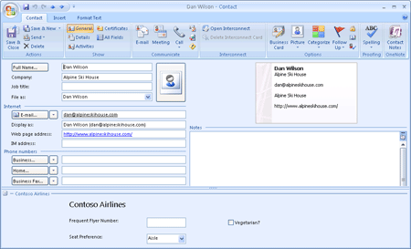
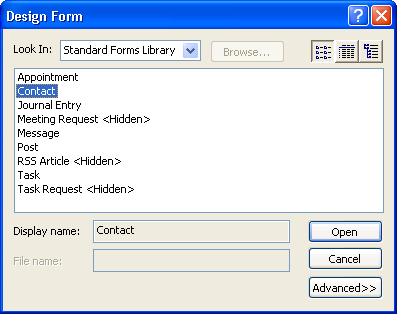
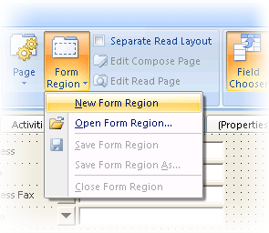
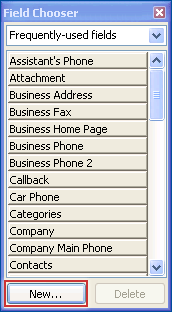
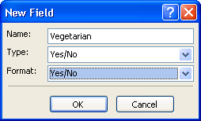
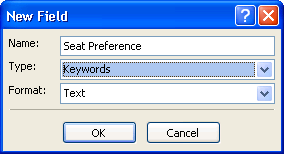
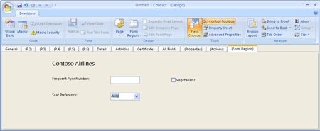
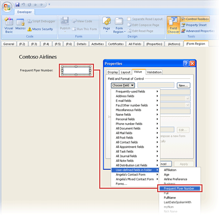
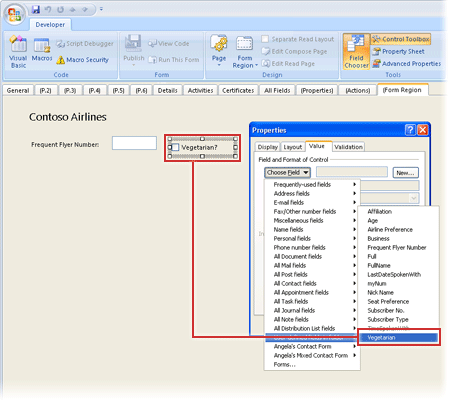

# Add a Form Region to an Existing Page on a Form

This walkthrough shows how to add an adjoining form region to the  **General** page of the standard Contact form. The major steps are as follows:


1. Use the Forms Designer to create an adjoining form region, and save the form region to an Outlook Form Storage (.OFS) file, Contoso.ofs.
    
2. Use a text editor, such as Notepad, to create a form region manifest XML file for the form region. This file describes to Outlook how to display the form region (for example, title, and localized action names) and what it does (for example, custom actions and add-in support).
    
3. Use the Windows Registry Editor to register the form region with a message class, identifying to Outlook the type of items that are elgible to use this form region.
    
4. Restart Outlook to use the updated Contact form.
    


Design the Form Region
To create and design a form region, you will use the Forms Designer in much the same way as you customize a form page, by adding controls from the control toolbox to the form region and optionally binding controls to fields. You will create an adjoining form region that will append to the end of the  **General** page of the contact form. This form region will contain six controls. You will insert the controls in the form region, create three user-defined fields, and bind the controls to the fields. When you are done with designing, you will save the form region to an .OFS file. Figure 1 shows the resultant **General** page of the Contact form.

**Figure 1. The customized Contact form at runtime - the General page showing an adjoining form region at the bottom.**




1. In Outlook, on the  **Developer** tab of the Microsoft Office Fluent ribbon, click **Design a Form**.
    
2. In the  **Design Form** box, click **Contact** and then click **Open**, as in Figure 2. 
    
    **Figure 2. Choose a standard form to start your customization.**


    

3. In the Forms Designer, click  **Form Region** and then **New Form Region**, as in Figure 3. 
    
    **Figure 3. Create a form region.**


    

4. Next, you will create three custom fields: Frequent Flyer Number, Vegetarian, and Seat Preference. If the Field Chooser has not been automatically displayed, click  **Field Chooser** to display it as in Figure 4.
    
    **Figure 4. Use the Field chooser to create custom fields.**


    

5. Click  **New**. Type  **Frequent Flyer Number** as the **Name** (see Figure 5), and click **OK** to create the Frequent Flyer Number field as a custom text field.
    
    **Figure 5. Create the custom field Frequent Flyer Number.**


    

6. Click  **New**. Type  **Vegetarian** as the **Name**, select  **Yes/No** as the **Type**, and select  **Yes/No** as the **Format** (see Figure 6), and click **OK** to create the Vegetarian field as a Yes/No field.
    
    **Figure 6. Create the custom field Vegetarian.**


    

7. Click  **New**. Type  **Seat Preference** as the **Name**, select  **Text** as the **Type** (see Figure 7), and click **OK** to create the Seat Preference field as a custom text field.
    
    **Figure 7. Create the custom field Seat Preference.**


    

8. In steps 9 through 12, you will insert six Outlook controls in the form region.
    
     **Note**  The control toolbox is initialized only with Microsoft Forms 2.0 controls. When you insert a Forms 2.0 control in a form region, if a themed Outlook counterpart control exists as an Outlook control, Outlook will automatically replace the Forms 2.0 control with the themed counterpart. In this walkthrough, the six controls that you will be inserting include one check box control, one combo box control, three label controls, and one text box control. By default, the Forms 2.0 version of these controls exist in the Toolbox. If you insert these controls in a form region, Outlook will always display these controls in the themed look; you do not need to add the Outlook counterpart controls to the Toolbox. This is because after you insert the Forms 2.0 controls from the Toolbox in the form region, Outlook will replace them with their themed Outlook counterpart controls - the Microsoft Outlook Check Box Control, the Microsoft Outlook Combo Box Control, the Microsoft Outlook Label Control, and the Microsoft Outlook Text Box Control. However, there are other Microsoft Outlook controls (for example, the Microsoft Outlook Recipient Control and the Microsoft Outlook Sender Photo Control) that do not exist in the Toolbox by default. To use these Outlook controls for the first time, you will have to add them to the Toolbox, by right-clicking the bottom of the Toolbox and clicking  **Custom Controls**.

    Figure 8 shows the resultant layout of the form region we are going to create. Steps 9, 10, 11, and 12 involve inserting controls from the Toolbox, and binding user-defined fields to some of the controls.
    

    **Figure 8. The desired form region in the Forms Designer.**


    

9. Add a label control for the title of the form region,  **Contoso Airlines**.
    
      1. Pick and click the label control to add it from the Toolbox to the form region as shown in Figure 8.
    
     **Note**  Using pick-and-click instead of drag-and-drop to insert a control from the Toolbox to the form region allows you to insert the control in the appropriate default size in the form region.
  2. Right-click the label control, click  **Properties**. On the  **Display** tab, type **Contoso Airlines** as the **Caption**. 
    
  3. Click  **Font**, and select  **14** under **Size**. Click  **OK**.
    
  4. Click  **OK**.
    
  5. Use the mouse to pull on the right handle of the label control to adjust the width to accommodate the length of the caption.
    
10. Add a label control and a text box control, and bind the Frequent Flyer Number field to the text box control.
    
      1. Pick and click another label control to add it from the Toolbox to the form region as shown in Figure 9.
    
  2. Right-click the label control, click  **Properties**. On the  **Display** tab, type **Frequent Flyer Number:** as the **Caption**. Click  **OK**.
    
  3. Use the mouse to pull on the right handle of the label control to adjust the width to accommodate the length of the caption.
    
  4. Pick and click the text box control to add it from the Toolbox to the form region as shown in Figure 9.
    
  5. Right-click the text box control, click  **Properties**. On the  **Value** tab, click **Choose Field**. Point to  **User-defined field in folder** in the drop-down list, and click **Frequent Flyer Number**, as in Figure 9. Then click  **OK**. 
    
    **Figure 9. Bind the Frequent Flyer Number field to the text box control.**


    

11. Add a check box control and bind the Vegetarian field to the check box control.
    
      1. Pick and click the check box control to add it from the Toolbox to the form region as shown in Figure 10.
    
  2. Right-click the check box control, click  **Properties**. On the  **Display** tab, type **Vegetarian?** as the **Caption**, as in Figure 10. 
    
    **Figure 10. Specify a caption for the check box control.**


    

  3. Click the  **Value** tab, click **Choose Field**. Point to  **User-defined field in folder** in the drop-down list, and click **Vegetarian**, as in Figure 11. Then click  **OK**. 
    
    **Figure 11. Bind the Vegetarian field to the check box control.**


    

12. Add a label control and a combo box control, and bind the Seat Preference field to the combo box control.
    
      1. Pick and click the label control to add it from the Toolbox to the form region as shown in Figure 12.
    
  2. Right-click the label control, click  **Properties**. On the  **Display** tab, type **Seat Preference:** as the **Caption**. Click  **OK**.
    
  3. Pick and click the combo box control to add it from the Toolbox to the form region as shown in Figure 12.
    
  4. Right-click the combo box control, click  **Properties**. On the  **Value** tab, click **Choose Field**. Point to  **User-defined field in folder** in the drop-down list, and click **Seat Preference**, as in Figure 12. 
    
    **Figure 12. Bind the Seat Preference field to the combo box control.**


    

  5. To define values for the drop-down list, type  **Aisle,Center,Window** as the **Possible Values**. 
    
  6. Check  **Set the initial value of this field to:**, and type  **Aisle** in the next text box as the initial display value. Then click **OK**.
    

    
    
13. Align controls on the form region.
    
    
    
      1. Hold down SHIFT, select the three label controls for  **Contoso Airlines**,  **Frequent Flyer Number**, and  **Seat Preference:**.
    
  2. Right-click, point to  **Align**, and select  **Align Left**. This will align the selected controls by their left edges.
    
  3. Hold down SHIFT, select the text box control and the combo box control.
    
  4. Right-click, point to  **Align**, and select  **Align Left**.
    
  5. Hold down SHIFT, select the label control for  **Frequent Flyer Number**, the text box control, and the check box control.
    
  6. Right-click, point to  **Align**, and select  **Align Bottom**. This will align the selected controls by their bottom edges.
    
  7. Hold down SHIFT, select the label control for  **Seat Preference:** and the combo box control.
    
  8. Right-click, point to  **Align**, and select  **Align Bottom**.
    

    
    
14. Click  **Form Region**, and click  **Save Form Region**. Create a folder  **Form Regions** in the c: drive, type **Contoso** as the file name, and click **Save**.
    
15. When Outlook asks  **Do you want to save changes**, click  **No**.
    
Create the Form Region Manifest XML File
Use an XML editor such as Notepad to create a form region manifest XML file, Contoso.xml, in the folder c:\Form Regions. Type the following lines: 


```xml
<?xml version="1.0"?> 
<FormRegion xmlns="http://schemas.microsoft.com/office/outlook/12/formregion.xsd"> 
    <!-- Internal name --> 
    <name>ContosoAdjoining</name> 
    <!-- Display name --> 
    <title>Contoso Airlines</title> 
    <!--  Additive adjoining form region --> 
    <formRegionType>adjoining</formRegionType> 
    <!--  Outlook form region file is in the current folder relative to the location of contoso.xml --> 
    <layoutFile>Contoso.ofs</layoutFile> 
    <!-- Display form region when inspector is in the Reading Pane --> 
    <showPreview>true</showPreview> 
    <!-- Version of form region --> 
    <version>1.0</version> 
</FormRegion> 

```

Register the Form Region
To run the form region, you must register it in the Windows registry, specifying the message class and other necessary information required for Outlook to display the form region. You will register this form region to display contact items, under the current user key,  **HKEY_CURRENT_USER\Software\Microsoft\Office\Outlook\FormRegions\IPM.Contact**.


1. Close Outlook.
    
2. Add the following key to the registry if it does not already exist:  **HKEY_CURRENT_USER\Software\Microsoft\Office\Outlook\FormRegions**.
    
3. Under the  **FormRegions** key, add the key **IPM.Contact**, if it does not already exist.
    
4. For the key  **IPM.Contact**, add a value of the type  **String**, specifying  **ContosoAdjoining** as the name, and **c:\Form Regions\contoso.xml** as the data.
    
5. Close the registry.
    
Use the Form Region


1. Start Outlook.
    
2. Open a contact item.
    
You will see the form region  **Contoso Airlines** at the bottom of the **General** page of the Contact form, as in Figure 1.

