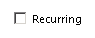

# OlkCheckBox Object (Outlook)

A control that supports one or more selections in a defined group of check box choices.

## Remarks

Before you use this control for the first time in the forms designer, add the Microsoft Outlook Check Box Control to the control toolbox. You can only add this control to a form region in an Outlook form using the forms designer.

The following is an example of a check box control that has been bound to the Recurring field. This control supports Microsoft Windows themes.

For more information about Outlook controls, see [Controls in a Custom Form](http://msdn.microsoft.com/library/fcba1b34-c526-5d01-8644-cb8852bd2348%28Office.15%29.aspx). For examples of add-ins in C# and Visual Basic .NET that use Outlook controls, see code sample downloads on MSDN. 

## Events

|**Name**|
|:-----|
|[AfterUpdate](olkcheckbox-afterupdate-event-outlook.md)|
|[BeforeUpdate](olkcheckbox-beforeupdate-event-outlook.md)|
|[Change](olkcheckbox-change-event-outlook.md)|
|[Click](olkcheckbox-click-event-outlook.md)|
|[DoubleClick](olkcheckbox-doubleclick-event-outlook.md)|
|[Enter](olkcheckbox-enter-event-outlook.md)|
|[Exit](olkcheckbox-exit-event-outlook.md)|
|[KeyDown](olkcheckbox-keydown-event-outlook.md)|
|[KeyPress](olkcheckbox-keypress-event-outlook.md)|
|[KeyUp](olkcheckbox-keyup-event-outlook.md)|
|[MouseDown](olkcheckbox-mousedown-event-outlook.md)|
|[MouseMove](olkcheckbox-mousemove-event-outlook.md)|
|[MouseUp](olkcheckbox-mouseup-event-outlook.md)|

## Properties

|**Name**|
|:-----|
|[Accelerator](olkcheckbox-accelerator-property-outlook.md)|
|[Alignment](olkcheckbox-alignment-property-outlook.md)|
|[BackColor](olkcheckbox-backcolor-property-outlook.md)|
|[BackStyle](olkcheckbox-backstyle-property-outlook.md)|
|[Caption](olkcheckbox-caption-property-outlook.md)|
|[Enabled](olkcheckbox-enabled-property-outlook.md)|
|[Font](olkcheckbox-font-property-outlook.md)|
|[ForeColor](olkcheckbox-forecolor-property-outlook.md)|
|[MouseIcon](olkcheckbox-mouseicon-property-outlook.md)|
|[MousePointer](olkcheckbox-mousepointer-property-outlook.md)|
|[TripleState](olkcheckbox-triplestate-property-outlook.md)|
|[Value](olkcheckbox-value-property-outlook.md)|
|[WordWrap](olkcheckbox-wordwrap-property-outlook.md)|

## See also

#### Other resources

[Outlook Object Model Reference](http://msdn.microsoft.com/library/73221b13-d8d8-99b8-3394-b95dbbfd5ddc%28Office.15%29.aspx)
