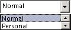

# OlkComboBox Object (Outlook)

A control that supports the display of a selection from a drop-down list of all choices.

## Remarks

Before you use this control for the first time in the forms designer, add the Microsoft Outlook Combo Box Control to the control toolbox. You can only add this control to a form region in an Outlook form using the forms designer.

The following is an example of a combo box control that has been bound to the Sensitivity field. This control supports Microsoft Windows themes.

If the  **[Click](olkcombobox-click-event-outlook.md)** event is implemented but the **[DropButtonClick](olkcombobox-dropbuttonclick-event-outlook.md)** event is not implemented, then clicking the drop button will fire only the **Click** event.

For more information about Outlook controls, see [Controls in a Custom Form](http://msdn.microsoft.com/library/fcba1b34-c526-5d01-8644-cb8852bd2348%28Office.15%29.aspx). For examples of add-ins in C# and Visual Basic .NET that use Outlook controls, see code sample downloads on MSDN. 

## Events

|**Name**|
|:-----|
|[AfterUpdate](olkcombobox-afterupdate-event-outlook.md)|
|[BeforeUpdate](olkcombobox-beforeupdate-event-outlook.md)|
|[Change](olkcombobox-change-event-outlook.md)|
|[Click](olkcombobox-click-event-outlook.md)|
|[DoubleClick](olkcombobox-doubleclick-event-outlook.md)|
|[DropButtonClick](olkcombobox-dropbuttonclick-event-outlook.md)|
|[Enter](olkcombobox-enter-event-outlook.md)|
|[Exit](olkcombobox-exit-event-outlook.md)|
|[KeyDown](olkcombobox-keydown-event-outlook.md)|
|[KeyPress](olkcombobox-keypress-event-outlook.md)|
|[KeyUp](olkcombobox-keyup-event-outlook.md)|
|[MouseDown](olkcombobox-mousedown-event-outlook.md)|
|[MouseMove](olkcombobox-mousemove-event-outlook.md)|
|[MouseUp](olkcombobox-mouseup-event-outlook.md)|

## Methods

|**Name**|
|:-----|
|[AddItem](olkcombobox-additem-method-outlook.md)|
|[Clear](olkcombobox-clear-method-outlook.md)|
|[Copy](olkcombobox-copy-method-outlook.md)|
|[Cut](olkcombobox-cut-method-outlook.md)|
|[DropDown](olkcombobox-dropdown-method-outlook.md)|
|[GetItem](olkcombobox-getitem-method-outlook.md)|
|[Paste](olkcombobox-paste-method-outlook.md)|
|[RemoveItem](olkcombobox-removeitem-method-outlook.md)|
|[SetItem](olkcombobox-setitem-method-outlook.md)|

## Properties

|**Name**|
|:-----|
|[AutoSize](olkcombobox-autosize-property-outlook.md)|
|[AutoTab](olkcombobox-autotab-property-outlook.md)|
|[AutoWordSelect](olkcombobox-autowordselect-property-outlook.md)|
|[BackColor](olkcombobox-backcolor-property-outlook.md)|
|[BorderStyle](olkcombobox-borderstyle-property-outlook.md)|
|[DragBehavior](olkcombobox-dragbehavior-property-outlook.md)|
|[Enabled](olkcombobox-enabled-property-outlook.md)|
|[EnterFieldBehavior](olkcombobox-enterfieldbehavior-property-outlook.md)|
|[Font](olkcombobox-font-property-outlook.md)|
|[ForeColor](olkcombobox-forecolor-property-outlook.md)|
|[HideSelection](olkcombobox-hideselection-property-outlook.md)|
|[ListCount](olkcombobox-listcount-property-outlook.md)|
|[ListIndex](olkcombobox-listindex-property-outlook.md)|
|[Locked](olkcombobox-locked-property-outlook.md)|
|[MaxLength](olkcombobox-maxlength-property-outlook.md)|
|[MouseIcon](olkcombobox-mouseicon-property-outlook.md)|
|[MousePointer](olkcombobox-mousepointer-property-outlook.md)|
|[SelectionMargin](olkcombobox-selectionmargin-property-outlook.md)|
|[SelLength](olkcombobox-sellength-property-outlook.md)|
|[SelStart](olkcombobox-selstart-property-outlook.md)|
|[SelText](olkcombobox-seltext-property-outlook.md)|
|[Style](olkcombobox-style-property-outlook.md)|
|[Text](olkcombobox-text-property-outlook.md)|
|[TextAlign](olkcombobox-textalign-property-outlook.md)|
|[TopIndex](olkcombobox-topindex-property-outlook.md)|
|[Value](olkcombobox-value-property-outlook.md)|

## See also

#### Other resources

[Outlook Object Model Reference](http://msdn.microsoft.com/library/73221b13-d8d8-99b8-3394-b95dbbfd5ddc%28Office.15%29.aspx)
