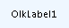

# OlkLabel Object (Outlook)

The basic label control, used for displaying text for read-only purposes.

## Remarks

Before you use this control for the first time in the forms designer, add the Microsoft Outlook Label Control to the control toolbox. You can only add this control to a form region in an Outlook form using the forms designer.

The following is an example of the label control at runtime showing the default caption. This control supports Microsoft Windows themes.

The label control typically provides information to or serves as a label for another control.

For more information about Outlook controls, see [Controls in a Custom Form](http://msdn.microsoft.com/library/fcba1b34-c526-5d01-8644-cb8852bd2348%28Office.15%29.aspx). For examples of add-ins in C# and Visual Basic .NET that use Outlook controls, see code sample downloads on MSDN. 

## Events

|**Name**|
|:-----|
|[Click](olklabel-click-event-outlook.md)|
|[DoubleClick](olklabel-doubleclick-event-outlook.md)|
|[MouseDown](olklabel-mousedown-event-outlook.md)|
|[MouseMove](olklabel-mousemove-event-outlook.md)|
|[MouseUp](olklabel-mouseup-event-outlook.md)|

## Properties

|**Name**|
|:-----|
|[Accelerator](olklabel-accelerator-property-outlook.md)|
|[AutoSize](olklabel-autosize-property-outlook.md)|
|[BackColor](olklabel-backcolor-property-outlook.md)|
|[BackStyle](olklabel-backstyle-property-outlook.md)|
|[BorderStyle](olklabel-borderstyle-property-outlook.md)|
|[Caption](olklabel-caption-property-outlook.md)|
|[Enabled](olklabel-enabled-property-outlook.md)|
|[Font](olklabel-font-property-outlook.md)|
|[ForeColor](olklabel-forecolor-property-outlook.md)|
|[MouseIcon](olklabel-mouseicon-property-outlook.md)|
|[MousePointer](olklabel-mousepointer-property-outlook.md)|
|[TextAlign](olklabel-textalign-property-outlook.md)|
|[UseHeaderColor](olklabel-useheadercolor-property-outlook.md)|
|[WordWrap](olklabel-wordwrap-property-outlook.md)|

## See also

#### Other resources

[Outlook Object Model Reference](http://msdn.microsoft.com/library/73221b13-d8d8-99b8-3394-b95dbbfd5ddc%28Office.15%29.aspx)
