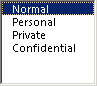

# OlkListBox Object (Outlook)

A control that supports displaying a scrollable list of items.

## Remarks

Before you use this control for the first time in the forms designer, add the Microsoft Outlook List Box Control to the control toolbox. You can only add this control to a form region in an Outlook form using the forms designer.

The following is an example of the list box control that has been bound to the Sensitivity field at runtime. This control supports Microsoft Windows themes.

For more information about Outlook controls, see [Controls in a Custom Form](http://msdn.microsoft.com/library/fcba1b34-c526-5d01-8644-cb8852bd2348%28Office.15%29.aspx). For examples of add-ins in C# and Visual Basic .NET that use Outlook controls, see code sample downloads on MSDN. 

## Events

|**Name**|
|:-----|
|[AfterUpdate](olklistbox-afterupdate-event-outlook.md)|
|[BeforeUpdate](olklistbox-beforeupdate-event-outlook.md)|
|[Change](olklistbox-change-event-outlook.md)|
|[Click](olklistbox-click-event-outlook.md)|
|[DoubleClick](olklistbox-doubleclick-event-outlook.md)|
|[Enter](olklistbox-enter-event-outlook.md)|
|[Exit](olklistbox-exit-event-outlook.md)|
|[KeyDown](olklistbox-keydown-event-outlook.md)|
|[KeyPress](olklistbox-keypress-event-outlook.md)|
|[KeyUp](olklistbox-keyup-event-outlook.md)|
|[MouseDown](olklistbox-mousedown-event-outlook.md)|
|[MouseMove](olklistbox-mousemove-event-outlook.md)|
|[MouseUp](olklistbox-mouseup-event-outlook.md)|

## Methods

|**Name**|
|:-----|
|[AddItem](olklistbox-additem-method-outlook.md)|
|[Clear](olklistbox-clear-method-outlook.md)|
|[Copy](olklistbox-copy-method-outlook.md)|
|[GetItem](olklistbox-getitem-method-outlook.md)|
|[GetSelected](olklistbox-getselected-method-outlook.md)|
|[RemoveItem](olklistbox-removeitem-method-outlook.md)|
|[SetItem](olklistbox-setitem-method-outlook.md)|
|[SetSelected](olklistbox-setselected-method-outlook.md)|

## Properties

|**Name**|
|:-----|
|[BackColor](olklistbox-backcolor-property-outlook.md)|
|[BorderStyle](olklistbox-borderstyle-property-outlook.md)|
|[Enabled](olklistbox-enabled-property-outlook.md)|
|[Font](olklistbox-font-property-outlook.md)|
|[ForeColor](olklistbox-forecolor-property-outlook.md)|
|[ListCount](olklistbox-listcount-property-outlook.md)|
|[ListIndex](olklistbox-listindex-property-outlook.md)|
|[Locked](olklistbox-locked-property-outlook.md)|
|[MatchEntry](olklistbox-matchentry-property-outlook.md)|
|[MouseIcon](olklistbox-mouseicon-property-outlook.md)|
|[MousePointer](olklistbox-mousepointer-property-outlook.md)|
|[MultiSelect](olklistbox-multiselect-property-outlook.md)|
|[Text](olklistbox-text-property-outlook.md)|
|[TextAlign](olklistbox-textalign-property-outlook.md)|
|[TopIndex](olklistbox-topindex-property-outlook.md)|
|[Value](olklistbox-value-property-outlook.md)|

## See also

#### Other resources

[Outlook Object Model Reference](http://msdn.microsoft.com/library/73221b13-d8d8-99b8-3394-b95dbbfd5ddc%28Office.15%29.aspx)
