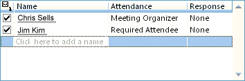

# OlkPageControl Object (Outlook)

A control that displays the contents of a page.

## Remarks

Before you use this control for the first time in the forms designer, add the Microsoft Outlook Page Control to the control toolbox. You can only add this control to a form region in an Outlook form using the forms designer; you cannot add this control to a Visual Basic  **UserForm** object in the Visual Basic Editor. This control supports Microsoft Windows themes.

Currently this control supports two Outlook pages: the free/busy scheduling page and the meeting request tracking page. The following is an example of the page control displaying a free/busy schedule at runtime. 

The following is an example of the page control displaying a meeting request tracking page at runtime. 

For more information about Outlook controls, see [Controls in a Custom Form](http://msdn.microsoft.com/library/fcba1b34-c526-5d01-8644-cb8852bd2348%28Office.15%29.aspx). For examples of add-ins in C# and Visual Basic .NET that use Outlook controls, see code sample downloads on MSDN. 

## Properties

|**Name**|
|:-----|
|[Page](olkpagecontrol-page-property-outlook.md)|

## See also

#### Other resources

[Outlook Object Model Reference](http://msdn.microsoft.com/library/73221b13-d8d8-99b8-3394-b95dbbfd5ddc%28Office.15%29.aspx)
