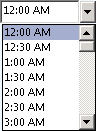

# OlkTimeControl Object (Outlook)

A control that displays the Outlook time drop-down menu. 

## Remarks

Before you use this control for the first time in the forms designer, add the Microsoft Outlook Time Control to the control toolbox. You can only add this control to a form region in an Outlook form using the forms designer; you cannot add this control to a Visual Basic  **UserForm** object in the Visual Basic Editor.

The time control has several different modes which are exposed via properties on the control. It can be bound to any  **DateTime** property, and can be bound to the same property as a date control to provide the capability to select both date and time.

The following is an example of the time control at runtime. This control supports Microsoft Windows themes.

If the  **[Click](olktimecontrol-click-event-outlook.md)** event is implemented but the **[DropButtonClick](olktimecontrol-dropbuttonclick-event-outlook.md)** event is not implemented, then clicking the drop button will fire only the **Click** event.

If you bind the time control to the start time or the end time of an appointment item, you must use an add-in to control enabling and disabling of the time control. In particular, when the user sets the appointment as an all-day event, you must use code to disable the time controls for the start time and the end time, and enable the controls only when the user clears this setting.

For more information about Outlook controls, see [Controls in a Custom Form](http://msdn.microsoft.com/library/fcba1b34-c526-5d01-8644-cb8852bd2348%28Office.15%29.aspx). For examples of add-ins in C# and Visual Basic .NET that use Outlook controls, see code sample downloads on MSDN. 

## Events

|**Name**|
|:-----|
|[AfterUpdate](olktimecontrol-afterupdate-event-outlook.md)|
|[BeforeUpdate](olktimecontrol-beforeupdate-event-outlook.md)|
|[Change](olktimecontrol-change-event-outlook.md)|
|[Click](olktimecontrol-click-event-outlook.md)|
|[DoubleClick](olktimecontrol-doubleclick-event-outlook.md)|
|[DropButtonClick](olktimecontrol-dropbuttonclick-event-outlook.md)|
|[Enter](olktimecontrol-enter-event-outlook.md)|
|[Exit](olktimecontrol-exit-event-outlook.md)|
|[KeyDown](olktimecontrol-keydown-event-outlook.md)|
|[KeyPress](olktimecontrol-keypress-event-outlook.md)|
|[KeyUp](olktimecontrol-keyup-event-outlook.md)|
|[MouseDown](olktimecontrol-mousedown-event-outlook.md)|
|[MouseMove](olktimecontrol-mousemove-event-outlook.md)|
|[MouseUp](olktimecontrol-mouseup-event-outlook.md)|

## Methods

|**Name**|
|:-----|
|[DropDown](olktimecontrol-dropdown-method-outlook.md)|

## Properties

|**Name**|
|:-----|
|[AutoSize](olktimecontrol-autosize-property-outlook.md)|
|[AutoWordSelect](olktimecontrol-autowordselect-property-outlook.md)|
|[BackColor](olktimecontrol-backcolor-property-outlook.md)|
|[BackStyle](olktimecontrol-backstyle-property-outlook.md)|
|[Enabled](olktimecontrol-enabled-property-outlook.md)|
|[EnterFieldBehavior](olktimecontrol-enterfieldbehavior-property-outlook.md)|
|[Font](olktimecontrol-font-property-outlook.md)|
|[ForeColor](olktimecontrol-forecolor-property-outlook.md)|
|[HideSelection](olktimecontrol-hideselection-property-outlook.md)|
|[IntervalTime](olktimecontrol-intervaltime-property-outlook.md)|
|[Locked](olktimecontrol-locked-property-outlook.md)|
|[MouseIcon](olktimecontrol-mouseicon-property-outlook.md)|
|[MousePointer](olktimecontrol-mousepointer-property-outlook.md)|
|[ReferenceTime](olktimecontrol-referencetime-property-outlook.md)|
|[Style](olktimecontrol-style-property-outlook.md)|
|[Text](olktimecontrol-text-property-outlook.md)|
|[TextAlign](olktimecontrol-textalign-property-outlook.md)|
|[Time](olktimecontrol-time-property-outlook.md)|
|[Value](olktimecontrol-value-property-outlook.md)|

## See also

#### Other resources

[Outlook Object Model Reference](http://msdn.microsoft.com/library/73221b13-d8d8-99b8-3394-b95dbbfd5ddc%28Office.15%29.aspx)
