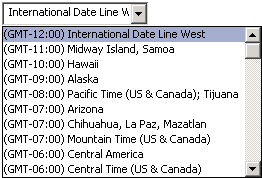

# OlkTimeZoneControl Object (Outlook)

A control that supports a selection from a drop-down list of time zones.

## Remarks

Before you use this control for the first time in the forms designer, add the Microsoft Outlook Time Zone Control to the control toolbox. You can only add this control to a form region in an Outlook form using the Forms Designer; you cannot add this control to a Visual Basic UserForm object in the Visual Basic Editor.

The following is an example of a time zone control. The time zone data can be obtained from the Windows registry key HKEY_LOCAL_MACHINE\SOFTWARE\Microsoft\Windows NT\CurrentVersion\Time Zones.

If an appointment item was originally created with a time zone value that no longer exists, the appointment time will be converted to the current local time zone.

## Events

|**Name**|
|:-----|
|[AfterUpdate](olktimezonecontrol-afterupdate-event-outlook.md)|
|[BeforeUpdate](olktimezonecontrol-beforeupdate-event-outlook.md)|
|[Change](olktimezonecontrol-change-event-outlook.md)|
|[Click](olktimezonecontrol-click-event-outlook.md)|
|[DoubleClick](olktimezonecontrol-doubleclick-event-outlook.md)|
|[DropButtonClick](olktimezonecontrol-dropbuttonclick-event-outlook.md)|
|[Enter](olktimezonecontrol-enter-event-outlook.md)|
|[Exit](olktimezonecontrol-exit-event-outlook.md)|
|[KeyDown](olktimezonecontrol-keydown-event-outlook.md)|
|[KeyPress](olktimezonecontrol-keypress-event-outlook.md)|
|[KeyUp](olktimezonecontrol-keyup-event-outlook.md)|
|[MouseDown](olktimezonecontrol-mousedown-event-outlook.md)|
|[MouseMove](olktimezonecontrol-mousemove-event-outlook.md)|
|[MouseUp](olktimezonecontrol-mouseup-event-outlook.md)|

## Methods

|**Name**|
|:-----|
|[DropDown](olktimezonecontrol-dropdown-method-outlook.md)|

## Properties

|**Name**|
|:-----|
|[AppointmentTimeField](olktimezonecontrol-appointmenttimefield-property-outlook.md)|
|[BorderStyle](olktimezonecontrol-borderstyle-property-outlook.md)|
|[Enabled](olktimezonecontrol-enabled-property-outlook.md)|
|[Locked](olktimezonecontrol-locked-property-outlook.md)|
|[MouseIcon](olktimezonecontrol-mouseicon-property-outlook.md)|
|[MousePointer](olktimezonecontrol-mousepointer-property-outlook.md)|
|[SelectedTimeZoneIndex](olktimezonecontrol-selectedtimezoneindex-property-outlook.md)|
|[Value](olktimezonecontrol-value-property-outlook.md)|

## See also

#### Other resources

[Outlook Object Model Reference](http://msdn.microsoft.com/library/73221b13-d8d8-99b8-3394-b95dbbfd5ddc%28Office.15%29.aspx)
