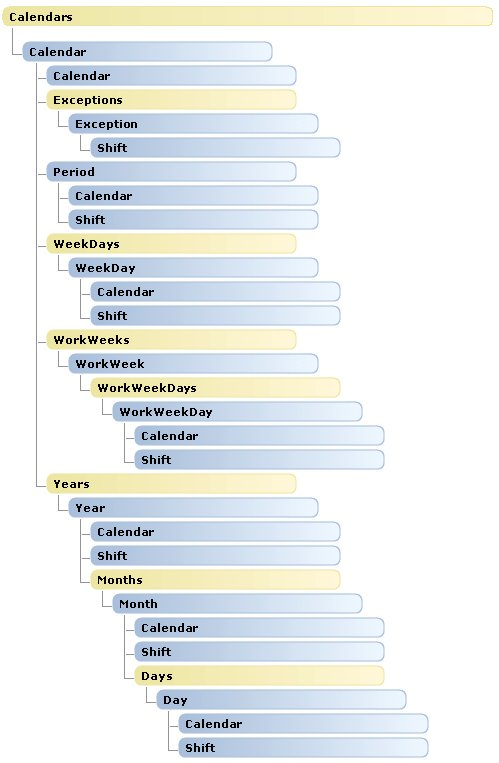

# Calendars object map (Project)

The  **Calendars** object map for Project shows the child objects of the **Calendars** collection object. There are no changes in the **Calendars** object hierarchy from Project.

 **Calendars** can be a child of **Application** or of **Project**. For example, the  **Application.GlobalBaseCalendars** property and the **Project.BaseCalendars** property each return a **Calendars** collection.

For an overview of the  **Application** and **Project** objects, and for details of the **Resources** and **Tasks** collections, see the following:

-  **[Application and Projects Object Map](application-and-projects-object-map-project.md)**
    
-  **[Resources Object Map](resources-object-map-project.md)**
    
-  **[Tasks Object Map](tasks-object-map-project.md)**
    

## Calendars Object Hierarchy

 **Note**  Objects in the following image do not link to the documentation pages.

