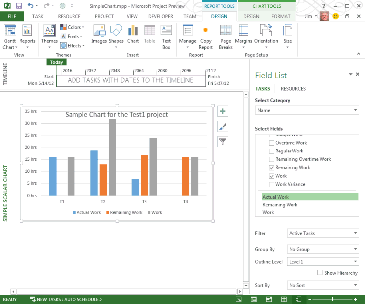

# Chart Object (Project)
The  **Chart** object represents a chart on a report in Project.


## Remarks

The  **Chart** object in Project includes the standard members that other Office applications implement for Office Art. For example, see the **Chart** object in the VBA object model for Word, Excel, and PowerPoint.

In Project, a chart is represented by a  **Chart** object, which is contained by a **[Shape](http://msdn.microsoft.com/library/d2b32bcd-5595-a4a7-9772-feb25fd0103a%28Office.15%29.aspx)** object or a **[ShapeRange](http://msdn.microsoft.com/library/315031aa-4b8c-424b-26e7-ce15897beb05%28Office.15%29.aspx)** collection in a **[Report](http://msdn.microsoft.com/library/38ef993e-e5cd-b451-06aa-41eb0e93450e%28Office.15%29.aspx)** object. For a diagram that shows the **Chart** object in the Project object model hierarchy, see[Application and Projects object map](http://msdn.microsoft.com/library/608f1291-ce25-8a5f-f0ba-7c1e823a12f4%28Office.15%29.aspx).


 **Note**  Macro recording for the  **Chart** object is not implemented. That is, when you record a macro in Project and manually add a chart, add chart elements, or manually format a chart in a report, the steps for adding and manipulating the chart are not recorded.

You can use the  **[Shapes.AddChart](http://msdn.microsoft.com/library/d404a9de-c1aa-c2a0-bf85-dc1f1735cf3c%28Office.15%29.aspx)** method to add a chart to a report. To determine whether a **Shape** or a **ShapeRange** contains a chart, use the **HasChart** method.

The  **Chart** object in Project does not implement events. So, a chart in Project cannot be animated to interact with mouse events or respond to events such as **Select** or **Calculate**, as it can in Excel.


## Example

The following example creates a simple scalar chart for tasks in the active project. The chart shows the  **Actual Work**,  **Remaining Work**, and  **Work** default fields.

To create some sample data, add four tasks to a new project, assign local resources to those tasks, and set various values of duration and actual work. For example, try the values in Table 1.


**Table 1. Sample data for a simple chart**


|**Task name**|**Duration**|**Actual work**|
|:-----|:-----|:-----|
|T1|2d|16|
|T2|5d|19|
|T3|4d|7|
|T4|2d|0|
?


```
Sub AddSimpleScalarChart()
    Dim chartReport As Report
    Dim reportName As String
    
    ' Add a report.
    reportName = "Simple scalar chart"
    Set chartReport = ActiveProject.Reports.Add(reportName)

    ' Add a chart.
    Dim chartShape As Shape
    Set chartShape = ActiveProject.Reports(reportName).Shapes.AddChart()
    
    chartShape.Chart.SetElement (msoElementChartTitleCenteredOverlay)
    chartShape.Chart.ChartTitle.Text = "Sample Chart for the Test1 project"
End Sub
```

When you run the  **AddSimpleScalarChart** macro, Project creates the report and adds a chart. The chart has default features, except the title is specified by the **SetElement** property to be overlaid on the chart, instead of the default position above the chart.


**Figure 1. The chart shows the data in Table 1**

To delete the chart, you can delete the shape that contains the chart. The following macro deletes the chart on the report that is created by the  **AddSimpleScalarChart** macro, and leaves the empty report as the active view.


```
Sub DeleteTheShape()
    Dim i As Integer
    Dim reportName As String
    Dim theShape As MSProject.Shape
    
    reportName = "Simple scalar chart"
        
    For i = 1 To ActiveProject.Reports.Count
        If ActiveProject.Reports(i).Name = reportName Then
            Set theShape = ActiveProject.Reports(i).Shapes(1)
            theShape.Delete
        End If
    Next i
End Sub
```

To delete the report, go to a different view, and then open the  **Organizer** dialog box. You cannot delete a report while the report is active. The **Organizer** is available on the **DEVELOPER** tab of the ribbon, and also on the **DESIGN** tab, in the **Report** group, on the **Manage** menu. On the **Reports** tab of the **Organizer** dialog box, select **Simple scalar chart** in the project pane, and then choose **Delete**. Alternately, run the following macro to delete the report.


```
Sub DeleteTheReport()
    Dim i As Integer
    Dim reportName As String
    
    reportName = "Simple scalar chart"

    ' To delete the active report, change to another view.
    ViewApplyEx Name:="&amp;Gantt Chart"
    
    ActiveProject.Reports(reportName).Delete
End Sub
```


## Methods


|**Name**|
|:-----|
|[ApplyChartTemplate](http://msdn.microsoft.com/library/ed449d73-6cae-6d54-de97-617612cd9129%28Office.15%29.aspx)|
|[ApplyCustomType](http://msdn.microsoft.com/library/2bfe88c2-198e-a039-ace6-4ba362ce09d6%28Office.15%29.aspx)|
|[ApplyDataLabels](http://msdn.microsoft.com/library/cda031a4-ed86-1ec8-583d-44767785e3a1%28Office.15%29.aspx)|
|[ApplyLayout](http://msdn.microsoft.com/library/943ca7d6-aa2e-9058-f33b-4efd4138b497%28Office.15%29.aspx)|
|[AutoFormat](http://msdn.microsoft.com/library/1f560c0e-aed8-c989-9721-8e30595ae56e%28Office.15%29.aspx)|
|[Axes](http://msdn.microsoft.com/library/0ab295f0-de68-7b8f-50a7-55a1e378080b%28Office.15%29.aspx)|
|[ChartWizard](http://msdn.microsoft.com/library/7626dc1f-89e1-3f18-0859-ebe2e0771de0%28Office.15%29.aspx)|
|[ClearToMatchColorStyle](http://msdn.microsoft.com/library/b2592ff4-8410-fa5c-a270-d03d47156607%28Office.15%29.aspx)|
|[ClearToMatchStyle](http://msdn.microsoft.com/library/6715dd6c-4213-6fc6-5cdb-5eefbaf9d875%28Office.15%29.aspx)|
|[Copy](http://msdn.microsoft.com/library/92627648-016a-0a69-52b8-bb24b1ea22d3%28Office.15%29.aspx)|
|[CopyPicture](http://msdn.microsoft.com/library/4353ddb2-51f0-a1a4-a472-ec8bbc83b146%28Office.15%29.aspx)|
|[Delete](http://msdn.microsoft.com/library/46312c6b-db7b-7562-d97a-d1fc8ba2acb7%28Office.15%29.aspx)|
|[Export](http://msdn.microsoft.com/library/4f0ed821-f1c1-0e0b-0583-51b660ffad90%28Office.15%29.aspx)|
|[GetChartElement](http://msdn.microsoft.com/library/f2705f1d-7252-41ec-848b-f7f9cc26663e%28Office.15%29.aspx)|
|[Refresh](http://msdn.microsoft.com/library/3b10e91f-3be8-1807-ad3f-8855286ce6a9%28Office.15%29.aspx)|
|[RefreshPivotTable](http://msdn.microsoft.com/library/3fed226a-2bb3-2112-01c9-d56a6defd346%28Office.15%29.aspx)|
|[SaveChartTemplate](http://msdn.microsoft.com/library/496eb522-d758-ea4c-1cd9-4884c3b44189%28Office.15%29.aspx)|
|[Select](http://msdn.microsoft.com/library/dd4e1adf-3098-61a3-5913-8debc7d01351%28Office.15%29.aspx)|
|[SeriesCollection](http://msdn.microsoft.com/library/fb4fea11-3dac-73f9-6566-6c81de0888e7%28Office.15%29.aspx)|
|[SetDefaultChart](http://msdn.microsoft.com/library/e0586f53-9ca4-7d06-97ed-ecc418644d9d%28Office.15%29.aspx)|
|[SetElement](http://msdn.microsoft.com/library/ca4acf62-c090-f11c-2816-c5e1a75762fa%28Office.15%29.aspx)|
|[SetSourceData](http://msdn.microsoft.com/library/723680bb-f2ec-3a8f-f392-a6c90eae7ff8%28Office.15%29.aspx)|
|[UpdateChartData](http://msdn.microsoft.com/library/ecdef74d-480c-05a7-757c-a5c2e3e7359c%28Office.15%29.aspx)|

## Properties


|**Name**|
|:-----|
|[Application](http://msdn.microsoft.com/library/708a0d37-763c-9805-4349-5ffd52376fd0%28Office.15%29.aspx)|
|[AutoScaling](http://msdn.microsoft.com/library/d7e1c8f7-8a2b-0474-1b4a-28a63605e929%28Office.15%29.aspx)|
|[BackWall](http://msdn.microsoft.com/library/886925db-3994-9f76-a2e4-099e7e24bd8e%28Office.15%29.aspx)|
|[BarShape](http://msdn.microsoft.com/library/a8259558-5541-65a8-8366-ae391bc943bd%28Office.15%29.aspx)|
|[ChartArea](http://msdn.microsoft.com/library/384eb030-741d-e69d-cd27-d4e414d7da8c%28Office.15%29.aspx)|
|[ChartColor](http://msdn.microsoft.com/library/bd8b5b9c-abfe-761b-a4bd-2978c43b9565%28Office.15%29.aspx)|
|[ChartData](http://msdn.microsoft.com/library/02cca9fd-00e1-a4c0-78e9-edabda0c160b%28Office.15%29.aspx)|
|[ChartGroups](http://msdn.microsoft.com/library/49e50578-3b97-4bc5-6037-3d32f0f321a7%28Office.15%29.aspx)|
|[ChartStyle](http://msdn.microsoft.com/library/e90f17dd-b9a8-4da1-d66a-2940e47953b5%28Office.15%29.aspx)|
|[ChartTitle](http://msdn.microsoft.com/library/eb2e9c18-1dcc-3d66-e73c-b5d0dfa88472%28Office.15%29.aspx)|
|[ChartType](http://msdn.microsoft.com/library/c2557457-8aab-dec9-8098-e14b31a87c4f%28Office.15%29.aspx)|
|[Creator](http://msdn.microsoft.com/library/d2ef5502-f55f-73ff-3df1-04aa22cbc9c0%28Office.15%29.aspx)|
|[DataTable](http://msdn.microsoft.com/library/858ba41c-a96c-0c3d-0faf-dcfcc448c6f9%28Office.15%29.aspx)|
|[DepthPercent](http://msdn.microsoft.com/library/868997e8-225c-5899-ccb0-71e1c8d9acfd%28Office.15%29.aspx)|
|[DisplayBlanksAs](http://msdn.microsoft.com/library/241fcca1-b736-799f-9f53-17751622e1e6%28Office.15%29.aspx)|
|[Elevation](http://msdn.microsoft.com/library/c99cdc9b-3d3d-60c8-400f-6fa8818b4fd2%28Office.15%29.aspx)|
|[Floor](http://msdn.microsoft.com/library/ae1f3f2b-e49c-63d1-f487-5d031fea20e5%28Office.15%29.aspx)|
|[Format](http://msdn.microsoft.com/library/3ccd9fd1-5a70-4692-ffd5-9b04544554fd%28Office.15%29.aspx)|
|[GapDepth](http://msdn.microsoft.com/library/22b3c702-6b1e-140b-13a7-04b6cd4bdab2%28Office.15%29.aspx)|
|[HasAxis](http://msdn.microsoft.com/library/f1059a7e-01ac-cd41-78d6-dc88f52943f2%28Office.15%29.aspx)|
|[HasDataTable](http://msdn.microsoft.com/library/ff2b3bb6-9508-d793-2382-29e3cbac872b%28Office.15%29.aspx)|
|[HasLegend](http://msdn.microsoft.com/library/3e4ba5bd-eb29-bb28-7403-87222b47ae40%28Office.15%29.aspx)|
|[HasTitle](http://msdn.microsoft.com/library/ba1105fa-9d22-7b15-f0b5-799b48f2c366%28Office.15%29.aspx)|
|[HeightPercent](http://msdn.microsoft.com/library/cb7e3a55-eb99-b02d-2242-ebdcbd954b35%28Office.15%29.aspx)|
|[Legend](http://msdn.microsoft.com/library/38c3332c-6087-4f7b-5c02-31cba5c6933f%28Office.15%29.aspx)|
|[Parent](http://msdn.microsoft.com/library/24a75836-8607-c7cb-906f-f4679b776001%28Office.15%29.aspx)|
|[Perspective](http://msdn.microsoft.com/library/a6a07c7a-ca79-d6aa-e6ef-1aa26b716852%28Office.15%29.aspx)|
|[PivotLayout](http://msdn.microsoft.com/library/d1c3cc4c-1c2c-4414-ffef-44b7667b95dc%28Office.15%29.aspx)|
|[PlotArea](http://msdn.microsoft.com/library/4d378a40-7417-1c1d-7424-9eb5cc7367c2%28Office.15%29.aspx)|
|[PlotBy](http://msdn.microsoft.com/library/10483232-929b-c040-025e-059ddf2fe915%28Office.15%29.aspx)|
|[PlotVisibleOnly](http://msdn.microsoft.com/library/0745cf62-2625-3f5f-3a33-97709cabba33%28Office.15%29.aspx)|
|[RightAngleAxes](http://msdn.microsoft.com/library/51e8cde1-53c7-90ff-b5c7-72a091461f6b%28Office.15%29.aspx)|
|[Rotation](http://msdn.microsoft.com/library/a6281031-fb66-6b79-47c2-d6708c997f32%28Office.15%29.aspx)|
|[Shapes](http://msdn.microsoft.com/library/b3b19bcb-9070-12ca-32b4-03711d62687a%28Office.15%29.aspx)|
|[ShowAllFieldButtons](http://msdn.microsoft.com/library/8e21d102-a23f-e56b-05d4-615f39f10a60%28Office.15%29.aspx)|
|[ShowAxisFieldButtons](http://msdn.microsoft.com/library/ac66ccc8-2e64-7734-c976-f0a50fc00e1f%28Office.15%29.aspx)|
|[ShowDataLabelsOverMaximum](http://msdn.microsoft.com/library/440bfd4b-069e-6963-d316-ea1bf84d411d%28Office.15%29.aspx)|
|[ShowLegendFieldButtons](http://msdn.microsoft.com/library/26a4eca3-0ef1-c26b-d2ea-861c8b08d738%28Office.15%29.aspx)|
|[ShowReportFilterFieldButtons](http://msdn.microsoft.com/library/717a8cd8-eee0-ac65-7358-bdbcbff01afa%28Office.15%29.aspx)|
|[ShowValueFieldButtons](http://msdn.microsoft.com/library/49192473-9ea6-ea09-f5d1-60badb44a525%28Office.15%29.aspx)|
|[SideWall](http://msdn.microsoft.com/library/d8b74dc2-7a22-1064-972d-876396414e2c%28Office.15%29.aspx)|
|[Walls](http://msdn.microsoft.com/library/8404e5cb-8da2-49b4-c49a-488d67457681%28Office.15%29.aspx)|

## See also


#### Other resources


[Shape Object](http://msdn.microsoft.com/library/d2b32bcd-5595-a4a7-9772-feb25fd0103a%28Office.15%29.aspx)
