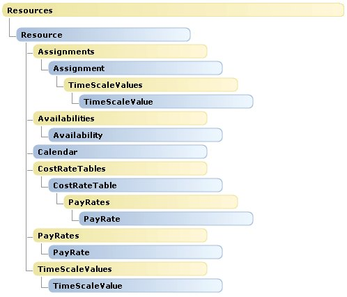

# Resources object map (Project)

The  **Resources** object map for Project shows the child objects of the **Resources** collection object. There are no changes in the **Resources** object hierarchy from Project.

 **Resources** can be a child of a **Project**,  **Task**, or  **Selection** object. For example, the **Project.Resources**,  **Task.Resources**, and  **Selection.Resources** properties each return a **Resources** collection.

For an overview of the  **Application** and **Project** objects, and for details of the **Calendar** and **Tasks** collections, see the following:

-  **[Application and Projects Object Map](application-and-projects-object-map-project.md)**
    
-  **[Calendars Object Map](calendars-object-map-project.md)**
    
-  **[Tasks Object Map](tasks-object-map-project.md)**
    

## Resources Object Hierarchy

 **Note**  Objects in the following image do not link to the documentation pages. To see this topic with an active link for each object, use the local VBA Help content on your computer. In the bottom right corner of the  **Project Help** window, right-click the **Connection Status** drop-down list, and then click **Show content only from this computer**.

