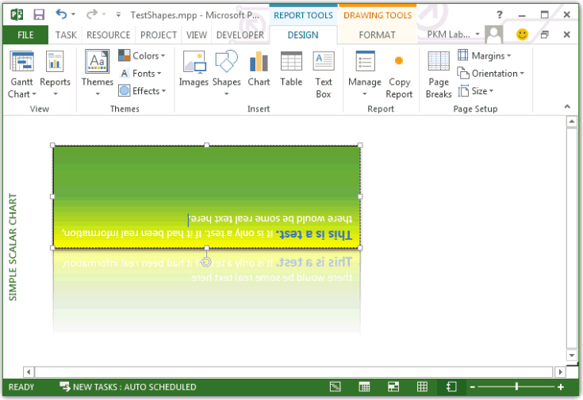

# Shape Object (Project)
Represents an object in a Project report, such as a chart, report table, text box, freeform drawing, or picture.
 

## Remarks

The  **Shape** object is a member of the **[Shapes](shapes-object-project.md)** collection, which includes all of the shapes in the report.
 

 

 **Note**  Macro recording for the  **Shape** object is not implemented. That is, when you record a macro in Project and manually add a shape or edit shape elements, the steps for adding and manipulating the shape are not recorded.
 

There are three objects that represent shapes: the  **Shapes** collection, which represents all the shapes on a document; the **ShapeRange** object, which represents a specified subset of the shapes on a document (for example, a **ShapeRange** object could represent shapes one and four on the document, or it could represent all the selected shapes on the document); and the **Shape** object, which represents a single shape on a document. If you want to work with several shapes at the same time or with shapes within the selection, use a **ShapeRange** collection.
 

 
Use  `Shapes(Index)`, where  _Index_ is the shape name or the index number, to return a single **Shape** object.
 

 

## Example

In the following example, the  **TestTextShape** macro creates a textbox shape, adds some text, and changes the shape style, fill, line, shadow, and reflection properties. The **FlipShape** macro flips the shape from top to bottom.
 

 

```
Sub TestTextShape()
    Dim theReport As Report
    Dim textShape As Shape
    Dim reportName As String
    
    reportName = "Simple scalar chart"
    
    Set theReport = ActiveProject.Reports(reportName)
    Set textShape = theReport.Shapes.AddTextbox(msoTextOrientationHorizontal, 30, 30, 300, 100)
    textShape.Name = "TestTextBox"
    
    textShape.TextFrame2.TextRange.Characters.Text = "This is a test. It is only a test. " _
        &amp; "If it had been real information, there would be some real text here."
    textShape.TextFrame2.TextRange.Characters(1, 15).ParagraphFormat.FirstLineIndent = 0
    
    ' Set the font for the first 15 characters to dark blue bold.
    With textShape.TextFrame2.TextRange.Characters(1, 15).Font
        .Fill.Visible = msoTrue
        .Fill.ForeColor.ObjectThemeColor = msoThemeColorAccent5
        .Fill.Transparency = 0
        .Fill.Solid
        .Size = 14
        .Bold = msoTrue
    End With
    
    textShape.ShapeStyle = msoShapeStylePreset42
    
    With textShape.Fill
        .Visible = msoTrue
        .ForeColor.RGB = RGB(255, 255, 0)
        .Transparency = 0
        '.Solid
    End With
   
    With textShape.Line
        .Visible = msoTrue
        .ForeColor.ObjectThemeColor = msoThemeColorText1
        .ForeColor.TintAndShade = 0
        .ForeColor.Brightness = 0
        .Transparency = 0
    End With

    textShape.Shadow.Type = msoShadow22
    textShape.Reflection.Type = msoReflectionType3
End Sub

Sub FlipShape()
    Dim theReport As Report
    Dim theShape As Shape
    Dim reportName As String
    Dim shapeName As String
    
    reportName = "Simple scalar chart"
    shapeName = "TestTextBox"
    
    Set theShape = ActiveProject.Reports(reportName).Shapes(shapeName)

    theShape.Flip msoFlipVertical
    theShape.Select
End Sub
```

Figure 1 shows the result, where the shape is selected to make the ribbon  **FORMAT** tab under **DRAWING TOOLS** available, although the active tab is **DESIGN** under **REPORT TOOLS**. If the shape were not selected,  **DRAWING TOOLS** and the **FORMAT** tab would not be visible.
 

 

**Figure 1. Testing the Shape object model**

 

 

 

## Methods


|**Name**|
|:-----|
|[Apply](shape-apply-method-project.md)|
|[Copy](shape-copy-method-project.md)|
|[Cut](shape-cut-method-project.md)|
|[Delete](shape-delete-method-project.md)|
|[Duplicate](shape-duplicate-method-project.md)|
|[Flip](shape-flip-method-project.md)|
|[IncrementLeft](shape-incrementleft-method-project.md)|
|[IncrementRotation](shape-incrementrotation-method-project.md)|
|[IncrementTop](shape-incrementtop-method-project.md)|
|[PickUp](shape-pickup-method-project.md)|
|[RerouteConnections](shape-rerouteconnections-method-project.md)|
|[ScaleHeight](shape-scaleheight-method-project.md)|
|[ScaleWidth](shape-scalewidth-method-project.md)|
|[Select](shape-select-method-project.md)|
|[SetShapesDefaultProperties](shape-setshapesdefaultproperties-method-project.md)|
|[Ungroup](shape-ungroup-method-project.md)|
|[ZOrder](shape-zorder-method-project.md)|

## Properties


|**Name**|
|:-----|
|[Adjustments](shape-adjustments-property-project.md)|
|[AlternativeText](shape-alternativetext-property-project.md)|
|[Application](shape-application-property-project.md)|
|[AutoShapeType](shape-autoshapetype-property-project.md)|
|[BackgroundStyle](shape-backgroundstyle-property-project.md)|
|[BlackWhiteMode](shape-blackwhitemode-property-project.md)|
|[Callout](shape-callout-property-project.md)|
|[Chart](shape-chart-property-project.md)|
|[Child](shape-child-property-project.md)|
|[ConnectionSiteCount](shape-connectionsitecount-property-project.md)|
|[Connector](shape-connector-property-project.md)|
|[ConnectorFormat](shape-connectorformat-property-project.md)|
|[Fill](shape-fill-property-project.md)|
|[Glow](shape-glow-property-project.md)|
|[GroupItems](shape-groupitems-property-project.md)|
|[HasChart](shape-haschart-property-project.md)|
|[HasTable](shape-hastable-property-project.md)|
|[Height](shape-height-property-project.md)|
|[HorizontalFlip](shape-horizontalflip-property-project.md)|
|[ID](shape-id-property-project.md)|
|[Left](shape-left-property-project.md)|
|[Line](shape-line-property-project.md)|
|[LockAspectRatio](shape-lockaspectratio-property-project.md)|
|[Name](shape-name-property-project.md)|
|[Nodes](shape-nodes-property-project.md)|
|[Parent](shape-parent-property-project.md)|
|[ParentGroup](shape-parentgroup-property-project.md)|
|[Reflection](shape-reflection-property-project.md)|
|[Rotation](shape-rotation-property-project.md)|
|[Shadow](shape-shadow-property-project.md)|
|[ShapeStyle](shape-shapestyle-property-project.md)|
|[SoftEdge](shape-softedge-property-project.md)|
|[Table](shape-table-property-project.md)|
|[TextEffect](shape-texteffect-property-project.md)|
|[TextFrame](shape-textframe-property-project.md)|
|[TextFrame2](shape-textframe2-property-project.md)|
|[ThreeD](shape-threed-property-project.md)|
|[Title](shape-title-property-project.md)|
|[Top](shape-top-property-project.md)|
|[Type](shape-type-property-project.md)|
|[VerticalFlip](shape-verticalflip-property-project.md)|
|[Vertices](shape-vertices-property-project.md)|
|[Visible](shape-visible-property-project.md)|
|[Width](shape-width-property-project.md)|
|[ZOrderPosition](shape-zorderposition-property-project.md)|

## See also


#### Other resources


 
[Report Object](report-object-project.md)
 
[Chart Object](chart-object-project.md)
