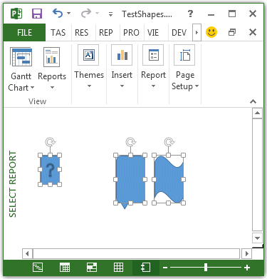

# Shape.Select Method (Project)
Selects the shape.

## Syntax

 _expression_. **Select** _(Replace)_

 _expression_ A variable that represents a **Shape** object.


### Parameters


|**Name**|**Required/Optional**|**Data type**|**Description**|
|:-----|:-----|:-----|:-----|
| _Replace_|Optional|**Variant**|**True** replaces the current selection with the new selection. **False** adds the new selection to the current selection. The default value is **True**.|
| _Replace_|Optional|VARIANT||

### Return value

 **Nothing**


## Example

The following example creates three shapes, and then selects each shape. Because the second and third selections add to the first selection, all three shapes are selected (see Figure 1).


```vb
Sub SelectShapes()
    Dim theReport As Report
    Dim shp1 As shape
    Dim shp2 As shape
    Dim shp3 As shape
    Dim reportName As String
    
    reportName = "Select Report"
    
    Set theReport = ActiveProject.Reports.Add(reportName)
    Set shp1 = theReport.Shapes.AddShape(msoShapeActionButtonHelp, 20, 50, 20, 30)
    Set shp2 = theReport.Shapes.AddShape(msoShapeBalloon, 100, 50, 30, 50)
    Set shp3 = theReport.Shapes.AddShape(msoShapeWave, 140, 50, 30, 50)
            
    shp1.Select
    shp2.Select False
    shp3.Select False
End Sub
```


**Figure 1. Using the Select method to add to a selection**




## See also


#### Other resources


[Shape Object](shape-object-project.md)
