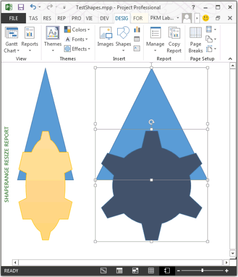

# ShapeRange.LockAspectRatio Property (Project)
Gets or sets a value that indicates whether the shape range retains its original proportions when you resize it; that is, the aspect ratio of the shape range is locked. Read-write  **[MsoTriState](http://msdn.microsoft.com/en-us/library/office/ff860737%28v=office.15%29)**.

## Syntax

 _expression_. **LockAspectRatio**

 _expression_ A variable that represents a **ShapeRange** object.


## Remarks

The  **LockAspectRatio** value is **msoTrue** if the shape range retains its original proportions when it is resized. If you can change the height and width of the shape range independently, the value is **msoFalse**.


## Example

The following example creates two shape ranges, with a triangle and a gear of the same size in each shape range. The left shape range has the aspect ratio unlocked, and the right shape range has the aspect ratio locked. Figure 1 shows the result when each shape range is resized by the same amount.

Changes to a shape range are applied to each shape in the range.


```vb
Sub ResizeShapeRanges()
    Dim shapeReport As Report
    Dim reportName As String
    Dim triangle1 As shape
    Dim triangle2 As shape
    Dim gear1 As shape
    Dim gear2 As shape
    Dim sRange1 As ShapeRange
    Dim sRange2 As ShapeRange
    
    reportName = "ShapeRange resize report"
    Set shapeReport = ActiveProject.Reports.Add(reportName)
    
    With shapeReport.Shapes
        Set triangle1 = .AddShape(msoShapeIsoscelesTriangle, 10, 10, 100, 100)
        Set gear1 = .AddShape(msoShapeGear6, 10, 120, 100, 100)
        Set triangle2 = .AddShape(msoShapeIsoscelesTriangle, 150, 10, 100, 100)
        Set gear2 = .AddShape(msoShapeGear6, 150, 120, 100, 100)
        
        gear2.BackgroundStyle = msoBackgroundStylePreset3
        
        Set sRange1 = .Range(Array(1, 2))
        Set sRange2 = .Range(Array(3, 4))
    End With
       
    sRange1.LockAspectRatio = msoFalse
    sRange1.height = 200
    
    ' Set a yellow shape style for gear1.
    sRange1(2).ShapeStyle = msoShapeStylePreset26
    
    sRange2.LockAspectRatio = msoTrue
    sRange2.height = 200
    
    sRange2.Select
End Sub
```

In Figure 1, the right shape range with the locked aspect ratio is selected.


**Figure 1. Resizing a shape range when the aspect ratio is unlocked or locked**




## Property value

 **MSOTRISTATE**


## See also


#### Other resources


[ShapeRange Object](shaperange-object-project.md)
[Shape.LockAspectRatio Property](shape-lockaspectratio-property-project.md)
[MsoTriState](http://msdn.microsoft.com/en-us/library/office/ff860737%28v=office.15%29)
