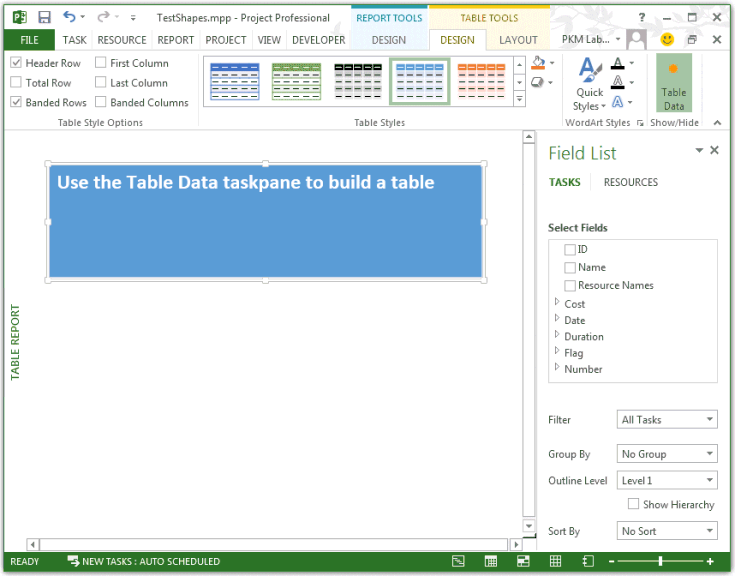
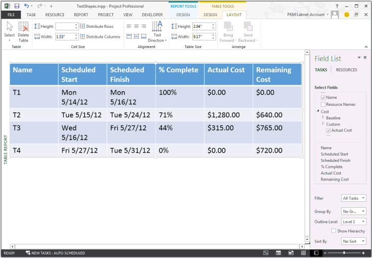

# Shapes.AddTable Method (Project)
Adds a table to the report, and returns a  **Shape** object that represents the table.

## Syntax

 _expression_. **AddTable** _(NumRows,_ _NumColumns,_ _Left,_ _Top,_ _Width,_ _Height)_

 _expression_ A variable that represents a **Shapes** object.


### Parameters


|**Name**|**Required/Optional**|**Data Type**|**Description**|
|:-----|:-----|:-----|:-----|
| _NumRows_|Required|**Long**|The number of rows in the table.  _NumRows_ is ignored when creating a table.|
| _NumColumns_|Required|**Long**|The number of columns in the table.  _NumColumns_ is ignored when creating a table.|
| _Left_|Required|**Single**|The left edge (in points) of the table, relative to the left side of the report pane.|
| _Top_|Required|**Single**|The top edge (in points) of the table, relative to the top of the report pane.|
| _Width_|Required|**Single**|The width of the table, in points.|
| _Height_|Required|**Single**|The height of the table, in points.|
| _NumRows_|Required|INT||
| _NumColumns_|Required|INT||
| _Left_|Required|FLOAT||
| _Top_|Required|FLOAT||
| _Width_|Required|FLOAT||
| _Height_|Required|FLOAT||
|Name|Required/Optional|Data type|Description|

### Return value

 **Shape**


## Remarks

Project ignores  _NumRows_ and _NumColumns_ when the **AddTable** method creates a table. When a table is created, it has one row and one column, which contains the text **Use the Table Data taskpane to build a table** (see Figure 1). When you select the table, Project shows the table data task pane named **Field List**, with  **TASKS** selected by default. Using the **Field List** task pane, you can manually add fields to the report.


**Figure 1. The AddTable method creates a table with one row and one column**




## Example

The  **TestReportTable** macro creates the table shown in Figure 1, and then selects the table to display the **Table Data** task pane.


```vb
Sub TestReportTable()
    Dim theReport As Report
    Dim tableShape As shape
    Dim theReportTable As ReportTable
    Dim reportName As String
    Dim tableName As String
    Dim rows As Integer
    Dim columns As Integer
    Dim left As Integer
    Dim top As Integer
    Dim width As Integer
    Dim height As Integer
    
    reportName = "Table Report"
    Set theReport = ActiveProject.Reports.Add(reportName)
    
     ' Add the table.
    tableName = "Task information"
    rows = 0
    columns = 0
    left = 0
    top = 30
    width = 110
    height = 20
       
    ' Project ignores the NumRows and NumColumns parameters when
    ' creating a ReportTable.
    Set tableShape = theReport.Shapes.AddTable(rows, columns, _
                        left, top, width, height)
    
    tableShape.Name = tableName
    tableShape.Select
    Set theReportTable = tableShape.Table
    
    With theReportTable
        Debug.Print "Rows: " &; .RowsCount
        Debug.Print "Columns: " &; .ColumnsCount
        Debug.Print "Cell 1,1 contents:" &; vbCrLf &; vbTab; .GetCellText(1, 1)
    End With
End Sub
```

To specify fields for the table, use the  **UpdateTableData** method. Add the following code after the `Set theReportTable = tableShape.Table` line in the previous macro. The _OutlineLevel_ parameter specifies level 1 tasks, and filters out the project summary task.


```
    ' Set fields for the table.
    Dim fieldArray(1 To 6) As PjField
        
    fieldArray(1) = pjTaskName
    fieldArray(2) = pjTaskStart
    fieldArray(3) = pjTaskFinish
    fieldArray(4) = pjTaskPercentComplete
    fieldArray(5) = pjTaskActualCost
    fieldArray(6) = pjTaskRemainingCost
        
    theReportTable.UpdateTableData Task:=True, OutlineLevel:=1, SafeArrayOfPjField:=fieldArray
```

Run the modified  **TestReportTable** macro on a project that has four tasks with various values for percent complete and resource costs. Figure 2 is an example of the table results.


**Figure 2. The UpdateTableData method can add fields to a table**




## See also


#### Other resources


[Shapes Object](shapes-object-project.md)
[Shape Object](shape-object-project.md)
[Application.Table Method](application-table-method-project.md)
