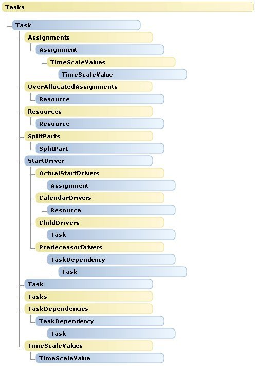

# Tasks object map (Project)

The  **Tasks** object map for Project shows the child objects of the **Tasks** collection object. There are no changes in the **Tasks** object hierarchy from Project.

A  **Tasks** collection can be a child of **Project**,  **Selection**, or another  **Task**. For example, the  **Task.PredecessorTasks** and the **Task.SuccessorTasks** properties each return a **Tasks** collection.

For an overview of the  **Application** and **Project** objects, and for details of the **Resources** and **Calendars** collections, see the following:

-  **[Application and Projects Object Map](application-and-projects-object-map-project.md)**
    
-  **[Calendars Object Map](calendars-object-map-project.md)**
    
-  **[Resources Object Map](resources-object-map-project.md)**
    

## Tasks Object Hierarchy

 **Note**  Objects in the following image do not link to the documentation pages.

