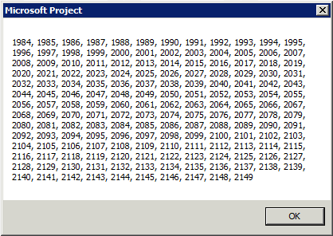

# Year Object (Project)

Represents a year in a project calendar. The  **Year** object is a member of the **[Years](years-object-project.md)** collection.
 


## Remarks

The  **Years** collection in Project begins in 1984 and ends in 2149. In previous versions of Project, scheduling can run from 1984 to 2049.
 

 

## Examples

 **Using the Year Object**
 

 
Use  **Years** ( _Index_), where  _Index_ is the year index number, to return a single **Year** object. The following example counts the number of working days in the month of September 2012 for each selected resource.
 

 


```
Dim r As Resource
Dim d As Integer
Dim workingDays As Integer
Dim theMonth As PjMonth

theMonth = pjSeptember

For Each r In ActiveSelection.Resources()
    workingDays = 0
    With r.Calendar.Years(2012).Months(theMonth)
        For d = 1 To .Days.Count
            If .Days(d).Working = True Then
                workingDays = workingDays + 1
            End If
        Next d
    End With
    MsgBox "There are " &amp; workingDays &amp; " working days in " _
        &amp; r.Name &amp; "'s calendar for month " &amp; theMonth
Next r
```

 **Using the Years Collection**
 

 
Use the  **[Years](calendar-years-property-project.md)** property to return a **Years** collection. The following example lists all the years in the calendar of the active project.
 

 


```
Sub CountYears()
    Dim c As Long
    Dim temp As String
        
    For c = 1 To ActiveProject.Calendar.Years.Count
        temp = temp &amp; ListSeparator &amp; " " &amp; _
            ActiveProject.Calendar.Years(c + 1983).Name
    Next c
            
    MsgBox Right$(temp, Len(temp) - Len(ListSeparator &amp; " "))
End Sub
```

Figure 1 shows the results of the  **CountYears** macro.
 

 

**Figure 1. Getting the list of years available**

 

 

 

## Methods


|**Name**|
|:-----|
|[Default](year-default-method-project.md)|

## Properties


|**Name**|
|:-----|
|[Application](year-application-property-project.md)|
|[Calendar](year-calendar-property-project.md)|
|[Count](year-count-property-project.md)|
|[Index](year-index-property-project.md)|
|[Months](year-months-property-project.md)|
|[Name](year-name-property-project.md)|
|[Parent](year-parent-property-project.md)|
|[Shift1](year-shift1-property-project.md)|
|[Shift2](year-shift2-property-project.md)|
|[Shift3](year-shift3-property-project.md)|
|[Shift4](year-shift4-property-project.md)|
|[Shift5](year-shift5-property-project.md)|
|[Working](year-working-property-project.md)|

