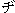

# Options.MatchFuzzyDZ Property (Word)

 **True** if Microsoft Word ignores the distinction between "
" and "
" and between "
" and "
" during a search. Read/write  **Boolean** .


## Syntax

 _expression_ . **MatchFuzzyDZ**

 _expression_ An expression that returns an **[Options](options-object-word.md)** object.


## Example

This example sets Microsoft Word to ignore the distinction between "
" and "
" and between "
" and "
" during a search.


```vb
Options.MatchFuzzyDZ = True
```


## See also


#### Concepts


[Options Object](options-object-word.md)

