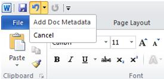

# Working with the UndoRecord Object

As end users work in Word, the actions they take that can be undone are recorded in a queue—the "undo stack"—so that if the user decides to reverse the action, Word can recall the action taken and undo it. The undo stack is visible through the Word user interface on the ribbon through the Undo button, where each action is listed as a discrete record in the stack. Automation using the Word object model also writes these "undo records" to the undo stack, but working with undo stack using can be problematic.

Developers sometimes write code that performs one logical task using a series of actions, where each action is recorded as a separate entry on the undo stack. However, even though the end user can undo each action separately, sometimes it is logical to undo all the steps of the task as a unit and not individually.

For example, a developer might write code that performs the task of inserting document metadata into the footer of a Word document as shown in the following code example.


```
Sub AddDocMetadata() 
Dim rngFooter As Range 
 
    Set rngFooter = ActiveDocument.Sections(1) _ 
        .Footers(wdHeaderFooterPrimary).Range 
         
    With rngFooter 
        .Delete 
        .Fields.Add Range:=rngFooter, Type:=wdFieldFileName, Text:="\p" 
        .InsertAfter Text:=vbTab &; vbTab 
        .Collapse Direction:=wdCollapseStart 
        .Fields.Add Range:=rngFooter, Type:=wdFieldAuthor 
    End With     
End Sub 

```

The resulting undo records appear on the undo stack for the actions performed by the code.


If the end user then needs to rollback or undo the "insert metadata" task, each action associated with the task must be undone individually (by pressing CTRL+Z or clicking the dropdown arrow on the  **Undo** button and then selecting the actions to undo). In this situation, the potential exists for the end user to only partially undo the series of actions associated with the single task, possibly leaving the document in an undesired state.

The Word object model offers a way to avoid this problem by providing developers the ability to link a series of individual actions into a custom undo record that can then be used to undo the actions as a single unit. A custom undo record is represented in the Word object model by the [UndoRecord](http://msdn.microsoft.com/library/77bf9801-e940-e661-6bbe-20a8714d5dbd%28Office.15%29.aspx) object.

## Using the UndoRecord Object

The [UndoRecord](http://msdn.microsoft.com/library/77bf9801-e940-e661-6bbe-20a8714d5dbd%28Office.15%29.aspx) object is a property of the [Application](http://msdn.microsoft.com/library/d1cf6f8f-4e88-bf01-93b4-90a83f79cb44%28Office.15%29.aspx) object in Word. You create a custom undo record using the [StartCustomRecord](http://msdn.microsoft.com/library/cd8d4337-4bbc-1943-6e0a-bc764861e886%28Office.15%29.aspx) and [EndCustomRecord](http://msdn.microsoft.com/library/af11d231-f799-d592-2bc5-de08030b41e4%28Office.15%29.aspx) methods of the [UndoRecord](http://msdn.microsoft.com/library/77bf9801-e940-e661-6bbe-20a8714d5dbd%28Office.15%29.aspx) object. Consider the following code example which modifies the previous example to include a custom undo record.


```
Dim objUndo As UndoRecord 
 
Sub AddDocMetadata() 
Dim rngFooter As Range 
 
Set objUndo = Application.UndoRecord 
 
'Begin the custom undo record and provide a name for the record 
objUndo.StartCustomRecord ("Add Doc Metadata") 
     
 Set rngFooter = ActiveDocument.Sections(1) _ 
        .Footers(wdHeaderFooterPrimary).Range 
         
 With rngFooter 
        .Delete 
        .Fields.Add Range:=rngFooter, Type:=wdFieldFileName, Text:="\p" 
        .InsertAfter Text:=vbTab &; vbTab 
        .Collapse Direction:=wdCollapseStart 
        .Fields.Add Range:=rngFooter, Type:=wdFieldAuthor 
 End With 
 
'End the custom undo record 
objUndo.EndCustomRecord 
     
End Sub 

```

The [StartCustomRecord](http://msdn.microsoft.com/library/cd8d4337-4bbc-1943-6e0a-bc764861e886%28Office.15%29.aspx) method begins recording the actions that are included in the custom undo record. You can give the custom undo record a name as an argument to the [StartCustomRecord](http://msdn.microsoft.com/library/cd8d4337-4bbc-1943-6e0a-bc764861e886%28Office.15%29.aspx) method, but this is optional. If you do not specify a name, Word uses the Visual Basic name of the first command executed as the name of the record. The name of the custom undo record is the string that appears in the user interface in the dropdown next to the **Undo** button.

The [EndCustomRecord](http://msdn.microsoft.com/library/af11d231-f799-d592-2bc5-de08030b41e4%28Office.15%29.aspx) method stops recording the custom undo record. All the actions taken by the code between the [StartCustomRecord](http://msdn.microsoft.com/library/cd8d4337-4bbc-1943-6e0a-bc764861e886%28Office.15%29.aspx) call and the [EndCustomRecord](http://msdn.microsoft.com/library/af11d231-f799-d592-2bc5-de08030b41e4%28Office.15%29.aspx) call are linked into one [UndoRecord](http://msdn.microsoft.com/library/77bf9801-e940-e661-6bbe-20a8714d5dbd%28Office.15%29.aspx) object. When you run code that creates a custom undo record, as in the previous code example, the custom undo record is listed in the undo stack as a single entry.





## UndoRecord Object Members

The following table lists other important members of the [UndoRecord](http://msdn.microsoft.com/library/77bf9801-e940-e661-6bbe-20a8714d5dbd%28Office.15%29.aspx).


|**Name**|**Member Type**|**Description**|
|:-----|:-----|:-----|
|**[CustomRecordLevel](http://msdn.microsoft.com/library/e0636c02-b1fb-2f88-c8a5-b52c88b65530%28Office.15%29.aspx)**|Property|Returns a  **Long** that specifies the number of custom undo action calls that are currently active. Read-only.|
|**[CustomRecordName](http://msdn.microsoft.com/library/97da07e1-3b9f-de7d-c2d8-af6af2bb2374%28Office.15%29.aspx)**|Property|Returns a  **String** that specifies the entry that appears on the undo stack when all custom undo actions have completed. Read-only.|
|**[IsRecordingCustomRecord](http://msdn.microsoft.com/library/08693e04-4a76-f7ab-9671-cdad35ac87ea%28Office.15%29.aspx)**|Property|Returns a  **Boolean** that specifies whether a custom undo action is being recorded. Read-only.|

## Best Practices


- Close each custom undo record with a call to [EndCustomRecord](http://msdn.microsoft.com/library/af11d231-f799-d592-2bc5-de08030b41e4%28Office.15%29.aspx). Word will attempt to determine where to end the record, but it may not be at the desired point of code execution.
    
- Call the [Document](http://msdn.microsoft.com/library/8d83487a-2345-a036-a916-971c9db5b7fb%28Office.15%29.aspx) object's [Undo](http://msdn.microsoft.com/library/f9fd64c9-aeb9-b698-6318-beb1db653ee6%28Office.15%29.aspx) method in the right order when calling from within a custom undo record. Calling the [Undo](http://msdn.microsoft.com/library/f9fd64c9-aeb9-b698-6318-beb1db653ee6%28Office.15%29.aspx) method in the wrong order within a custom undo record can have undesired effects on your code execution. The following code example shows the [Undo](http://msdn.microsoft.com/library/f9fd64c9-aeb9-b698-6318-beb1db653ee6%28Office.15%29.aspx) method being called from inside a custom undo record.
    
```
Sub UndoInUndoRecord() 
   
  Set objUndo = Application.UndoRecord 
  
  objUndo.StartCustomRecord ("New Paragraph") 
  
  ActiveDocument.Content.InsertAfter Text:=" The end." 
  ActiveDocument.Undo 
  ActiveDocument.Content.InsertAfter Text:=" The end, again." 
  ActiveDocument.Content.InsertAfter Text:=" The last end." 
 
  objUndo.EndCustomRecord 
 
End Sub
```

When this code is run, each action in the custom undo record prior to the  **Undo** method call is undone. Each action in the custom undo record after the **Undo** method call is placed the undo stack.

- Avoid switching documents inside a custom undo record. The following code example switches from one document to another inside a custom undo record.

```
Dim objUndo As UndoRecord 

Sub SwitchDocsInsideUndo() 
  Set objUndo = Application.UndoRecord objUndo.StartCustomRecord ("New Paragraph") 
  
  'Insert some text into the first document Documents(1).Content.InsertAfter "A new paragraph in doc1." 
  
  'Switch documents to the second document 
  'The custom undo record will terminate here Documents(2).Content.InsertAfter "A new paragraph in doc2." 
  
  objUndo.EndCustomRecord 
End Sub
```

When this code is run, Word terminates the custom undo record when the code begins to write to the second document. When the procedure is finished, only the first document will have a custom undo record with the name "New Paragraph."
    
- Avoid using Breaks when running code that contains custom undo records in Debug mode. When code that contains undo records is run in Debug mode in the Visual Basic editor and the code encounters a breakpoint, Word automatically ends all custom records that are currently in progress.
    

